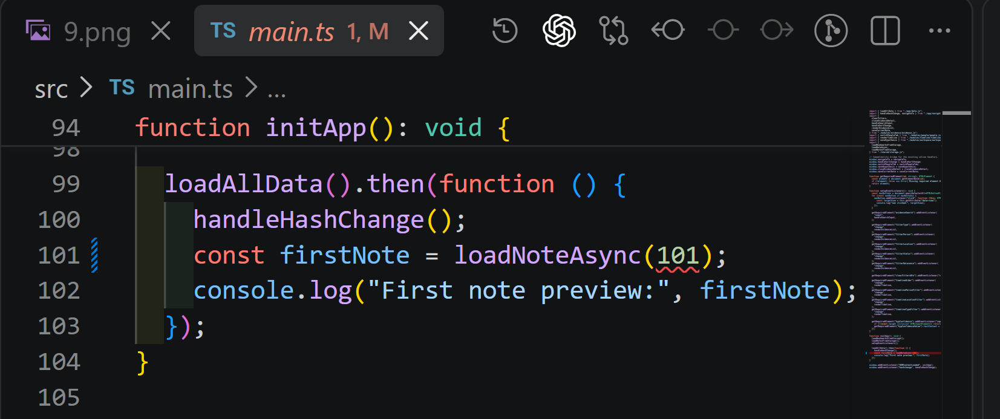
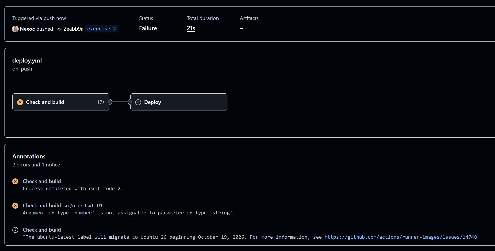
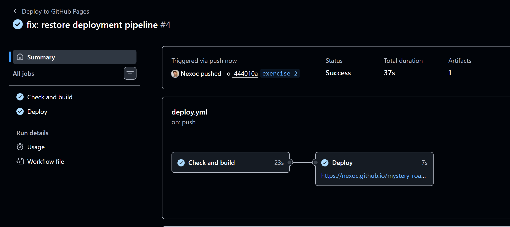

# Demo 10 – Trigger, Rechte und Fehlerfall

## Ziel

Ein echter TypeScript-Fehler soll das Deployment stoppen. Die letzte funktionierende Version der
Anwendung muss dabei online bleiben.

## Schritt 1 – TypeScript-Fehler einbauen

In `src/main.ts` wurde absichtlich eine Zahl statt einer Evidence-ID als String übergeben:

```ts
loadNoteAsync(101);
```

`lint` und `format:check` waren weiterhin erfolgreich. TypeScript meldete dagegen:

```text
TS2345: Argument of type 'number' is not assignable to parameter of type 'string'.
```



Der Fehler wurde mit Commit `2eabb9a` auf `exercise-2` gepusht.

## Schritt 2 – Blockiertes Deployment prüfen

Der Job `Check and build` stoppte beim TypeScript-Check in `npm run build`. Er endete nach 17
Sekunden mit Exit Code 2. Der abhängige Job `Deploy` wurde nicht ausgeführt und es entstand kein
neues Pages-Artifact.



Die vorher veröffentlichte Anwendung blieb erreichbar und funktionierte weiterhin:

```text
https://nexoc.github.io/mystery-road-awe-2026/
```

Das ist das gewünschte Verhalten: Ein fehlerhafter Commit ersetzt nicht die stabile Version.

## Schritt 3 – Fehler korrigieren

Der Aufruf wurde wieder auf den korrekten String geändert:

```ts
loadNoteAsync("E01");
```

Danach liefen lokal erfolgreich:

```text
npm run typecheck
npm run lint
npm run format:check
npm run build
```

Der Fix wurde mit Commit `444010a` gepusht. Der neue Workflow war nach 37 Sekunden erfolgreich:
`Check and build` dauerte 23 Sekunden, `Deploy` 7 Sekunden und ein Artifact wurde veröffentlicht.



## Permissions und Secrets

Der Build-Job besitzt nur:

- `contents: read` für den Repository-Inhalt
- `pages: read` für die Pages-Konfiguration

Der Deploy-Job besitzt nur:

- `pages: write` für die Veröffentlichung
- `id-token: write` für die OIDC-Prüfung

Die Rechte stehen direkt in `.github/workflows/deploy.yml`. Ein eigenes Secret ist nicht nötig.
GitHub erstellt für den Run ein temporäres `GITHUB_TOKEN`. Das Environment `github-pages` erlaubt
Deployments von `main` und `exercise-2`.

Zu breite Rechte wären gefährlich: Ein fehlerhafter oder manipulierter Step könnte mehr Daten lesen
oder verändern als nötig.

## Trigger

- `push`: startet nach einem Push auf einen konfigurierten Branch.
- `pull_request`: prüft Änderungen eines PR vor dem Merge.
- `workflow_dispatch`: erlaubt einen manuellen Start in GitHub Actions.

`quality.yml` nutzt Push und Pull Request für `exercise-2` sowie den manuellen Start. `deploy.yml`
nutzt Push auf `exercise-2` und den manuellen Start. Ein Pull Request deployt nicht, weil noch nicht
übernommener Code nicht veröffentlicht werden soll.

## Run History erklären

Unter `Actions` zeigen beide Workflows ihre Runs und Logs. Im fehlgeschlagenen Deploy-Run verweist
die Annotation direkt auf `src/main.ts:101`. Dadurch ist sichtbar, welcher Step, welche Datei und
welcher TypeScript-Fehler das Deployment blockiert hat.
