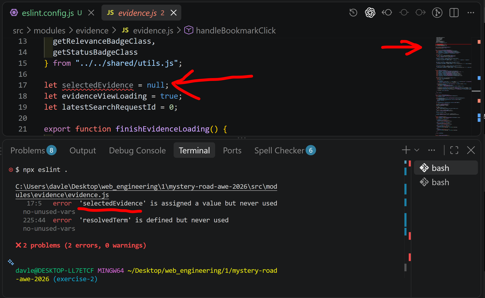
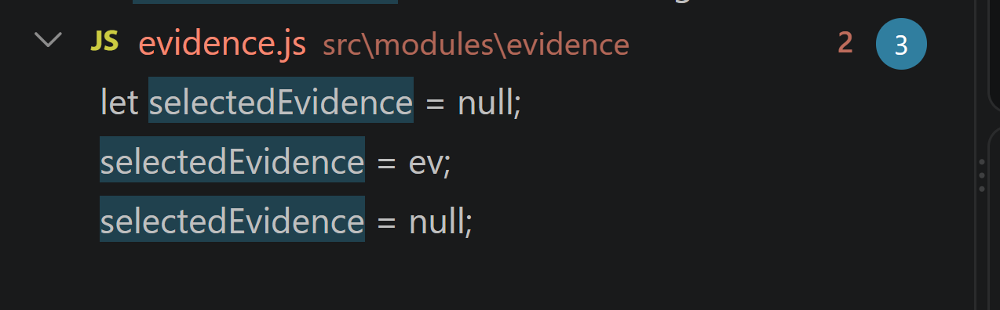
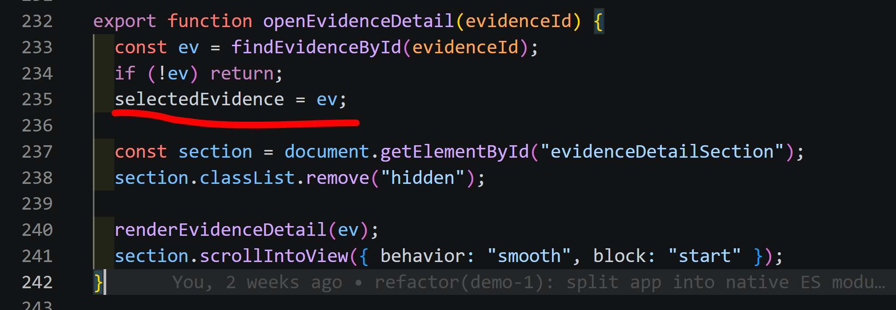
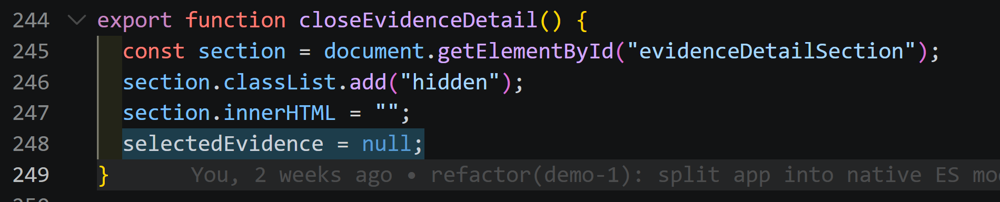
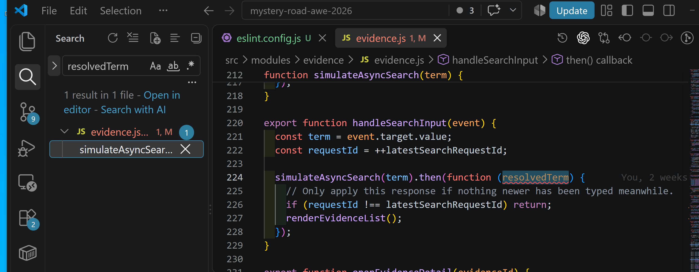

# Demo 4 – ESLint und Prettier

## Ziel

Code-Probleme automatisch finden und ein einheitliches Format für die Source-Dateien nutzen.

## Schritt 1 – Tools und Konfiguration

ESLint 10.11.0 und Prettier 3.9.9 wurden als `devDependencies` installiert.
Die Flat Config `eslint.config.js` prüfte `**/*.js` und ignorierte `dist/**` und `node_modules/**`.
Sie verwendete ES Modules, aktuelles ECMAScript und Browser-Globals als `readonly`.

Der erste Lauf meldete sieben Konfigurations- und Codefehler:

```bash
npx eslint .
```

## Schritt 2 – Browser-Global `setTimeout`

Mehrere Meldungen lauteten `setTimeout is not defined`. Das Programm war korrekt, aber das
Browser-Global fehlte in der ESLint-Konfiguration. Mit `setTimeout: "readonly"` verschwanden
diese False Positives. Danach blieben zwei echte `no-unused-vars`-Fehler:



## Schritt 3 – `selectedEvidence` entfernen

`selectedEvidence` wurde gesetzt, aber nie gelesen. Die Suche zeigte drei Source-Stellen:
eine Deklaration und zwei Zuweisungen.



Beim Öffnen eines Details wurde das gefundene Evidence-Objekt gespeichert, aber danach nicht
über `selectedEvidence` verwendet:



Beim Schließen wurde die Variable wieder auf `null` gesetzt, ebenfalls ohne spätere Nutzung:



Darum wurden Deklaration, Zuweisung und Reset entfernt. Danach gab es keine Source-Vorkommen
mehr; die Suche fand nur noch alte Dokumentation aus Exercise 1:


## Schritt 4 – Unbenutzten Callback-Parameter entfernen

Auch `resolvedTerm` wurde im Promise-Callback definiert, aber nicht benutzt:



```js
simulateAsyncSearch(term).then(function () {
  if (requestId !== latestSearchRequestId) return;
  renderEvidenceList();
});
```

## Schritt 5 – Scripts und Formatierung

Folgende Scripts wurden ergänzt:

- `lint`: `eslint .`
- `lint:fix`: `eslint . --fix`
- `format`: Prettier für Source- und relevante Root-Dateien

`prettier --write .` war zuerst zu breit und änderte etwa 35 Dateien. Diese Änderungen wurden
zurückgenommen. Danach wurde der Bereich bewusst begrenzt:

```json
"format": "prettier --write \"src/**/*.{js,ts}\" \"*.{js,json,html,css}\""
```

Ein konkreter Prettier-Fund in `package.json` war `"private" : true`. Prettier änderte diese Zeile
zu `"private": true`. Nur der Abstand änderte sich, nicht die Bedeutung.

## Antworten auf die Fragen

- Ein Linter findet mögliche Fehler, zum Beispiel unbenutzte Variablen. Ein Formatter ändert
  nur die Schreibweise, zum Beispiel Einrückung, Zeilenumbrüche und Abstände.
- `lint` verändert nichts und eignet sich für Kontrolle und CI. `lint:fix` darf sichere Regeln
  automatisch anwenden; logische Probleme brauchen weiter eine bewusste Entscheidung.
- `npm run lint` liest das Script aus `package.json` und startet das lokale Binary aus
  `node_modules/.bin`. Eine globale ESLint-Installation ist deshalb nicht nötig und wäre für
  reproduzierbare Versionen ungeeignet.

## Prüfung und Ergebnis

`npm run format`, `npm run lint` und `npm run build` liefen erfolgreich. Danach wurde die App
im Dev-Server geprüft. Der Commit hieß `Add linting and formatting tools`.
