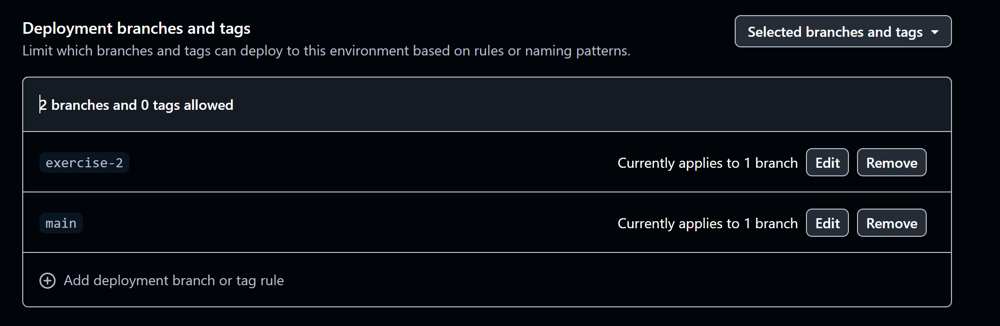

# Demo 9 – Automatisches Deployment mit GitHub Pages

## Ziel

Nach jedem Push auf `exercise-2` wird die Anwendung geprüft, gebaut und automatisch auf GitHub
Pages veröffentlicht.

## Schritt 1 – Pages aktivieren

Im Repository wurde unter `Settings → Pages → Build and deployment` die Source `GitHub Actions`
gewählt. Die angebotenen Jekyll- und Static-HTML-Workflows wurden nicht verwendet, weil das Projekt
einen eigenen Vite Build braucht.

## Schritt 2 – Workflow erstellen

Der zweite Workflow liegt in `.github/workflows/deploy.yml`. Er startet bei einem Push auf
`exercise-2` oder manuell über `workflow_dispatch`. Pull Requests deployen nicht.

Der Job `build` führt aus:

```text
Checkout
Setup Node.js 22.23.2 mit npm cache
npm ci
npm run lint
npm run format:check
npm run build
Upload von dist/ als github-pages Artifact
```

`npm run build` startet `tsc --noEmit` und danach den Vite Production-Build.

## Schritt 3 – Vite Base Path setzen

Die Pages-Adresse enthält den Repository-Namen. Deshalb setzt `vite.config.ts`:

```ts
base: "/mystery-road-awe-2026/";
```

Der Build erzeugt dadurch Pfade wie `/mystery-road-awe-2026/assets/...`. JSON-Dateien und Bilder
werden ebenfalls unter dem Repository-Pfad geladen.

## Schritt 4 – Artifact deployen

Der Job `deploy` läuft nur nach einem erfolgreichen `build`. `upload-pages-artifact` packt `dist/`
als Artifact. `deploy-pages` veröffentlicht dieses Artifact über die Pages API. Ein `gh-pages`
Branch wird nicht erstellt.

Benötigte Rechte:

- `contents: read` und `pages: read` für den Build
- `pages: write` für das Deployment
- `id-token: write` für die OIDC-Prüfung

Ein eigenes Secret ist nicht nötig. GitHub stellt `GITHUB_TOKEN` bereit.

## Schritt 5 – Ersten Workflow-Run korrigieren

Der erste `Check and build` Job war nach 19 Sekunden erfolgreich. Der Deploy-Job wurde aber durch
die Environment-Regel abgelehnt:

```text
Branch "exercise-2" is not allowed to deploy to github-pages.
```

Im Environment `github-pages` war nur `main` erlaubt. Unter
`Settings → Environments → github-pages → Deployment branches and tags` wurde zusätzlich die Branch
Rule `exercise-2` eingetragen. Danach wurde nur der fehlgeschlagene Job erneut gestartet. Dafür war
kein neuer Commit nötig.



## Ergebnis

Der zweite Deploy-Versuch war nach 7 Sekunden erfolgreich. Die Anwendung öffnete sich unter:

```text
https://nexoc.github.io/mystery-road-awe-2026/
```

## Antworten

Der Workflow prüft und baut erneut, weil jeder Workflow auf einem neuen Runner läuft. Ergebnisse aus
Demo 8 werden nicht automatisch übernommen. So wird genau der Commit gebaut, der online geht.

Bei einem anderen Static Host bleiben Checkout, Installation, Lint und Build gleich. Nur die
Pages-Schritte, Rechte, Zugangsdaten und eventuell der Vite Base Path ändern sich.

## Live-Demo

1. Dashboard, Evidence, People, Timeline und Workspace öffnen.
2. In DevTools JSON-Dateien und Personenbilder mit Status `200` zeigen.
3. Eine sichtbare Änderung pushen und prüfen, dass sie automatisch online erscheint.
