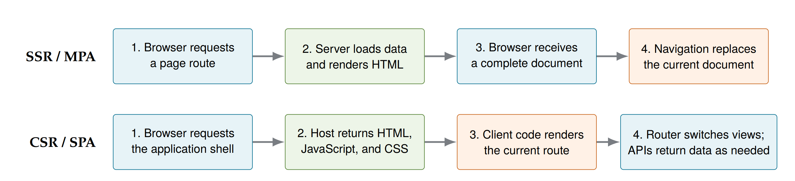
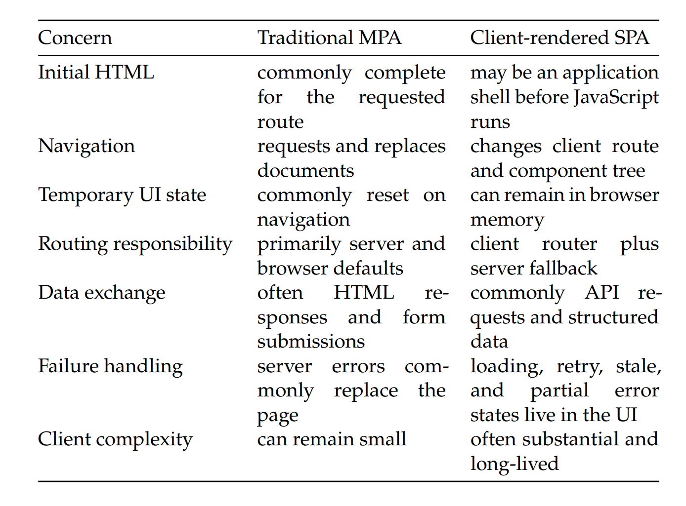
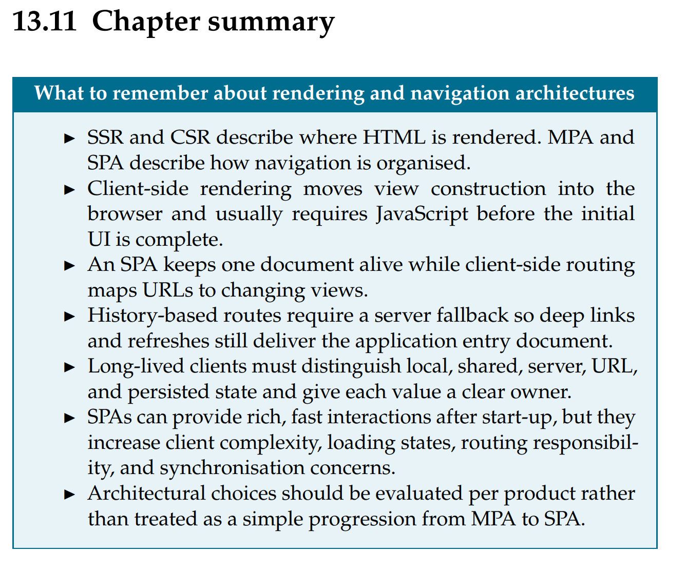

# Demo 2 – SSR und CSR

## Ziel

Ich vergleiche Server-Side Rendering und Client-Side Rendering und ordne unser Projekt ein.

Wichtig: SSR/CSR beschreibt, **wo HTML erzeugt wird**. MPA/SPA beschreibt, **wie Navigation
organisiert ist**. Diese Begriffe werden oft kombiniert, sind aber nicht identisch.

## Kurzer Vergleich

| Punkt | SSR | CSR |
|---|---|---|
| Erste Antwort | fertiges HTML für die Route | App-Shell, CSS und JavaScript |
| Vor sichtbarem Inhalt | Browser verarbeitet hauptsächlich HTML und CSS | Browser lädt und startet JavaScript; oft werden weitere Daten geladen |
| Weitere Navigation | häufig neuer Request und neues Dokument | Client-Router wechselt die View; Daten kommen bei Bedarf per API |
| Ohne JavaScript | Hauptinhalt ist meistens lesbar | dynamischer Hauptinhalt fehlt häufig |
| Hauptaufwand | Rendering und Routing auf dem Server | State, Rendering und Routing im Browser |

## Reales Beispiel: Wikipedia

Wikipedia ist bei normalen Artikelseiten hauptsächlich serverseitig gerendert und verhält sich wie
eine MPA. Das kann ich live so prüfen:

1. Einen Wikipedia-Artikel öffnen.
2. `View Page Source` öffnen und nach der Artikelüberschrift oder einem Satz suchen.
3. Der Artikeltext steht bereits in der ersten HTML-Antwort.
4. Im Network-Tab neu laden: Der Request vom Typ `document` enthält den Hauptinhalt.
5. Einen normalen Artikellink öffnen: Der Browser lädt ein neues Dokument für die neue URL.

JavaScript ergänzt interaktive Funktionen, erzeugt aber nicht erst den grundlegenden Artikeltext.
Darum ist die Artikelseite primär SSR, auch wenn einzelne Funktionen clientseitig arbeiten.

## Wie lädt unser Dashboard?

Unser Projekt ist hauptsächlich CSR und nutzt SPA-Navigation:

1. Der Browser fordert `index.html`, `styles.css` und das JavaScript-Modul an.
2. `index.html` enthält die Shell und leere Container, aber noch keine Falldaten im Dashboard.
3. Nach `DOMContentLoaded` startet `initApp()` in `src/main.ts`.
4. `loadAllData()` lädt Case, People, Locations, Evidence und Timeline als JSON.
5. Die geprüften Daten werden im clientseitigen `state` gespeichert.
6. `renderDashboard()` erzeugt Summary, Statistiken, Fortschritt und Listen im Browser.
7. `handleHashChange()` aktiviert `#dashboard` oder eine andere View.

Beim Wechsel zu `#evidence` oder `#timeline` wird kein neues HTML-Dokument geladen. JavaScript
ändert den Hash, CSS-Klassen und den sichtbaren Inhalt.

## Welche Kosten hat diese Entscheidung?

Ohne JavaScript werden die JSON-Daten nicht geladen und das echte Dashboard nicht gerendert. Der
Loading-Zustand bleibt stehen und die Anwendung ist nicht sinnvoll benutzbar.

Bei einer langsamen Verbindung muss der Benutzer zuerst JavaScript und mehrere JSON-Dateien laden,
bevor das Dashboard vollständig ist. Ein Crawler, der JavaScript nicht ausführt, sieht ebenfalls
nicht die dynamisch erzeugten Falldaten. Das ist der konkrete Preis für CSR in diesem Projekt.

## Kurzer Abschluss für die Präsentation

Wikipedia liefert den Hauptinhalt bereits als HTML vom Server. Unser Projekt liefert zuerst eine
statische Shell und baut das Dashboard danach mit JavaScript und JSON im Browser. Deshalb ist es
hauptsächlich eine clientseitig gerenderte SPA.
