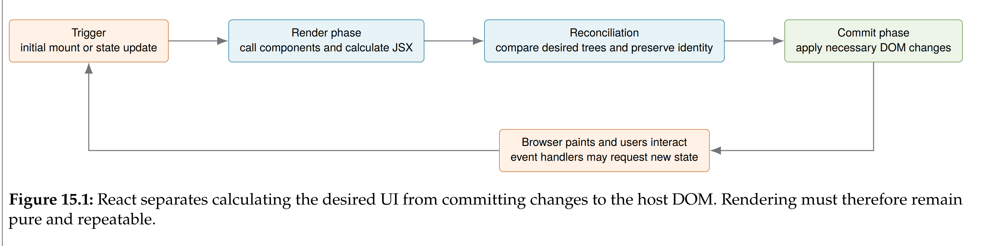
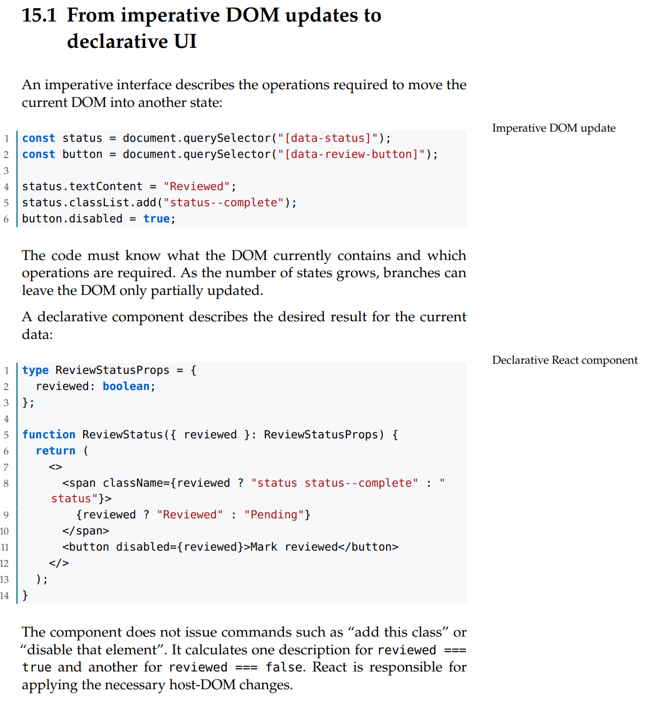
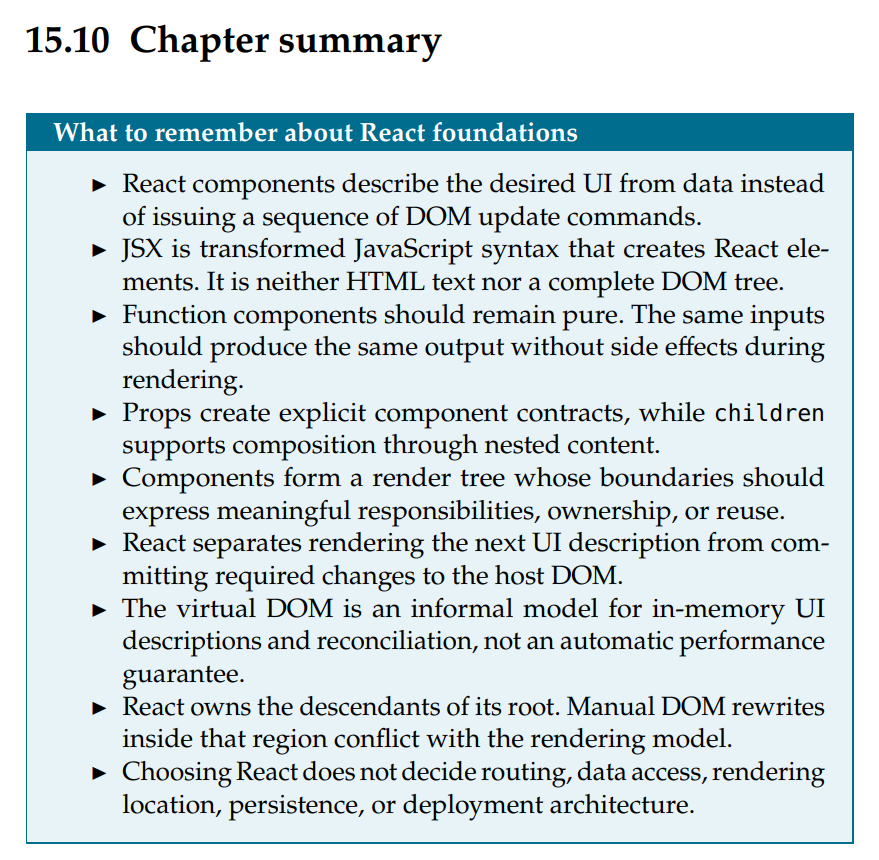

# Demo 3 – Virtual DOM

## Ziel

Ich erkläre den Virtual DOM an einem konkreten Problem aus dem ursprünglichen `app.js`.

## Was ist der Virtual DOM?

Der Virtual DOM ist eine Beschreibung der gewünschten Benutzeroberfläche als JavaScript-Objekte im
Speicher. Nach einer State-Änderung berechnet React eine neue Beschreibung und vergleicht sie mit der
vorherigen. Dieser Vergleich heißt Reconciliation. Erst danach schreibt React die notwendigen
Änderungen in den echten Browser-DOM.



Der Virtual DOM verhindert nicht jede neue Berechnung. Komponenten können erneut ausgeführt werden,
aber React muss deshalb nicht automatisch alle echten DOM-Elemente ersetzen.

## Konkretes Beispiel aus dem alten `app.js`

Beim Klick auf einen Bookmark-Button ändert sich nur ein kleiner Zustand:

- eine Evidence-ID wird zu `bookmarks` hinzugefügt oder daraus entfernt;
- bei genau einer Evidence ändert sich `bookmarked`;
- sichtbar müssen sich nur Stern und CSS-Klasse eines Buttons ändern.

Der alte Ablauf war aber sinngemäß:

```js
function handleBookmarkClick(evidenceId) {
  // bookmarks und Evidence-Flag ändern
  saveBookmarksToStorage();
  if (currentPage === "evidence") renderEvidenceList();
}

function renderEvidenceList() {
  let html = "";
  for (const evidence of filteredEvidence) {
    html += renderEvidenceCardHTML(evidence);
  }
  container.innerHTML = html;
}
```

`renderEvidenceList()` erzeugt also alle sichtbaren Evidence Cards erneut als String. Anschließend
ersetzt `innerHTML` den kompletten Inhalt von `#evidenceList`, obwohl nur ein Bookmark-Button anders
aussieht. Dieses Verhalten stammt aus dem ursprünglichen `app.js` und blieb beim reinen Refactoring
in `src/modules/evidence/evidence.ts` erhalten.

## Wie würde ein Virtual DOM helfen?

In React würde das Bookmark als State geändert. React berechnet den neuen Komponentenbaum und
vergleicht ihn mit dem alten. Mit stabilen `key`-Werten erkennt React die einzelnen Evidence Cards.
Unveränderte Cards behalten ihre echten DOM-Elemente; beim betroffenen Button werden nur notwendige
Eigenschaften wie Klasse und Stern aktualisiert.



## Ist der Virtual DOM automatisch schneller?

Nein. Ein direkter, gezielter DOM-Befehl für genau einen bekannten Button kann schneller sein. React
muss zuerst Komponenten ausführen, neue Beschreibungen erzeugen und beide Bäume vergleichen. Diese
Arbeit kostet ebenfalls Zeit und Speicher.

Der Tausch ist deshalb:

- manuelle DOM-Updates können sehr schnell sein, sind bei vielen Zuständen aber schwer zu verwalten;
- deklaratives Rendering kostet Reconciliation, hält UI und State dafür zuverlässiger synchron;
- React versucht anschließend, teure Änderungen am echten DOM auf das Notwendige zu begrenzen.

## Macht React eine Anwendung automatisch schnell?

Nein. Eine React-Anwendung kann weiterhin langsam sein, zum Beispiel durch:

- große Listen ohne Virtualisierung;
- teure Berechnungen bei jedem Render;
- unnötig hoch platzierten State und dadurch viele Re-Renders;
- instabile oder falsche `key`-Werte;
- große JavaScript-Bundles, langsame Requests oder aufwendige Effects;
- Layout Thrashing und unnötige DOM-Messungen.



## Kurzer Abschluss für die Präsentation

Beim Bookmark-Beispiel ersetzt Vanilla JavaScript die ganze Evidence-Liste. React würde ebenfalls
eine neue UI-Beschreibung berechnen, aber durch Reconciliation nur die nötigen echten DOM-Änderungen
committen. Das ist ein Wartbarkeits- und Konsistenzvorteil, keine automatische Performance-Garantie.
