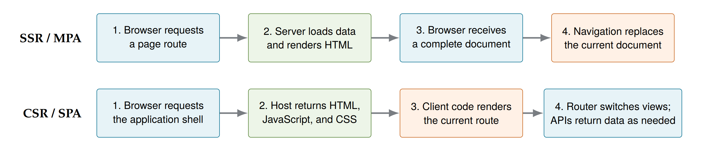
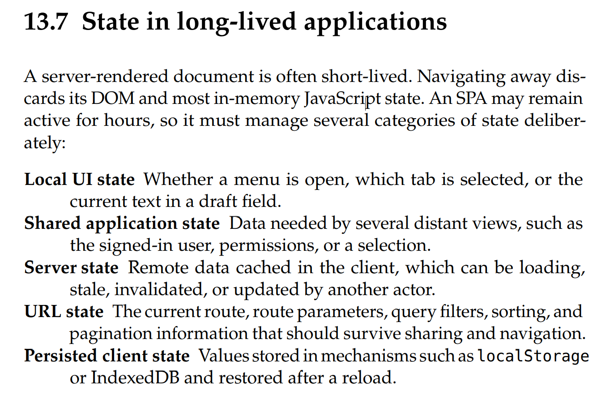
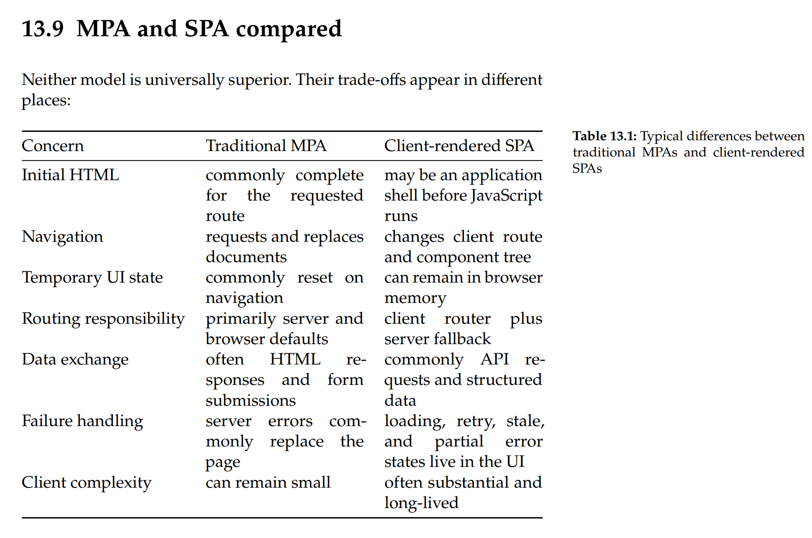

# Demo 4 – SPA und MPA: State und Routing

## Ziel

Ich zeige, wie Navigation und State in der aktuellen Anwendung funktionieren und was bei einem
vollständigen Reload passiert.

## Aktuelle Navigation

```text
Klick auf Navigation
  → navigateTo("evidence")
  → window.location.hash = "evidence"
  → Browser erzeugt einen History-Eintrag und sendet hashchange
  → handleHashChange() prüft den Hash
  → state.currentPage wird geändert
  → CSS-Klassen und aktive Navigation werden aktualisiert
  → passende Render-Funktion läuft
```



Dabei passiert **kein** neuer Document-Request. `index.html`, JavaScript und der In-Memory-State
bleiben erhalten. Nur die sichtbare View innerhalb desselben Dokuments wechselt.

## State bei einem vollständigen Reload



### Bleibt erhalten oder wird wiederhergestellt

| State | Speicherort |
|---|---|
| aktuelle View | URL-Hash wie `#evidence`; wird nach dem Reload erneut gelesen |
| Bookmark-IDs | `localStorage`: `remotion_bookmarks` |
| gespeicherte Evidence Notes | `localStorage`: `remotion_notes` |
| gespeicherter Hypothesenentwurf | `localStorage`: `remotion_hypothesis` |
| Case, People, Locations, Evidence, Timeline | JSON-Dateien; werden neu geladen und validiert |

Der Hypothesenentwurf enthält Suspect, Nature, Evidence-IDs, Confidence, Explanation, Alternative und
den Zeitpunkt des Speicherns.

### Geht verloren oder wird auf den Standard zurückgesetzt

- Evidence-Suche, alle Evidence-Filter und Sortierung;
- Timeline-Reihenfolge und alle Timeline-Filter;
- ausgewählter People/Locations-Tab;
- offene Evidence-Detailansicht und offenes Timeline-Modal;
- nicht gespeicherter Text in Note oder Hypothese;
- während der Sitzung geänderte Evidence-Werte `status` und `relevance`;
- `filteredEvidence`, Render-Cache-Flags und aktueller DOM-Inhalt;
- Loading-Zähler, laufende Search-ID, Fokus und kurze Statusmeldungen. Eine Scrollposition kann der
  Browser unabhängig vom App-State wiederherstellen.

Die Datenarrays im Arbeitsspeicher gehen ebenfalls verloren, werden aber aus den JSON-Dateien neu
aufgebaut. Bookmarks und gespeicherte Notes werden danach aus `localStorage` ergänzt.

## Wo liegen Daten bei MPA und SPA?

Bei einer klassischen MPA besitzt normalerweise der Server die Daten, zum Beispiel in Datenbank oder
Session. Für jeden Request erzeugt er ein neues HTML-Dokument. Der alte DOM und temporärer
JavaScript-State werden verworfen.

In unserer SPA liegen geladene Daten und UI-State lange im Browser-Speicher. Das macht Navigation
schnell und erhält State zwischen Views. Dafür muss der Client Laden, Synchronisation, Fehler und
veraltete Daten selbst behandeln.



## Was würde eine Router-Bibliothek zusätzlich übernehmen?

Unser Router kennt nur fünf Hash-Werte und schaltet CSS-Klassen. Eine Router-Bibliothek kann außerdem:

- eine deklarative Route-Tabelle sowie verschachtelte Layouts verwalten;
- Pfadparameter, Query-Parameter, Redirects und eine Not-Found-Route behandeln;
- Links, aktive Navigation und History einheitlich verwalten;
- Lazy Loading, Route Data Loading und Fehlerzustände organisieren;
- Scroll Restoration und Fokus nach Navigation unterstützen;
- bei History-Routen zusammen mit dem Server korrekte Deep Links ermöglichen.

## Was macht der Back Button?

Jede Änderung zu einem anderen Hash erzeugt normalerweise einen History-Eintrag. Beim Back Button
stellt der Browser den vorherigen Hash wieder her und löst `hashchange` aus. `handleHashChange()` zeigt
daraufhin die vorherige View, ohne die Seite neu zu laden. Erst wenn der Benutzer vor den ersten
Eintrag dieser Anwendung zurückgeht, kann der Browser die Anwendung verlassen.

## Kurzer Abschluss für die Präsentation

Die SPA hält ein Dokument und viel State im Browser. Der Hash macht die aktuelle View teilbar und
navigierbar; nur bewusst gespeicherte Werte überleben einen Reload. Der eigene Router reicht für fünf
Views, übernimmt aber deutlich weniger Aufgaben als eine vollständige Router-Bibliothek.
