# Demo 6 – React + TypeScript Entry Point

## Ziel

React wurde in das bestehende Vite-Projekt eingebaut, ohne die funktionierende Vanilla-Version zu entfernen.
Die Demo zeigt zuerst nur ein minimales `<App />`; Shell und Dashboard folgen später.

## Installierte Pakete und ihre Aufgaben

- `react` stellt Components, JSX Runtime und React APIs bereit.
- `react-dom` verbindet React mit dem Browser-DOM. Daraus kommt `createRoot()`.
- `@vitejs/plugin-react` integriert React in Vite und aktiviert unter anderem Fast Refresh.
- `@types/react` und `@types/react-dom` liefern TypeScript die Typen der beiden Libraries.

`react` und `react-dom` sind Runtime Dependencies. Plugin und Typen werden nur für Entwicklung und Build benötigt. TypeScript und Vite waren bereits installiert.

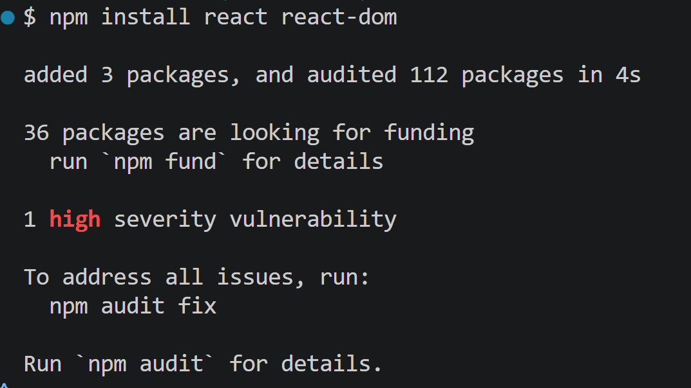

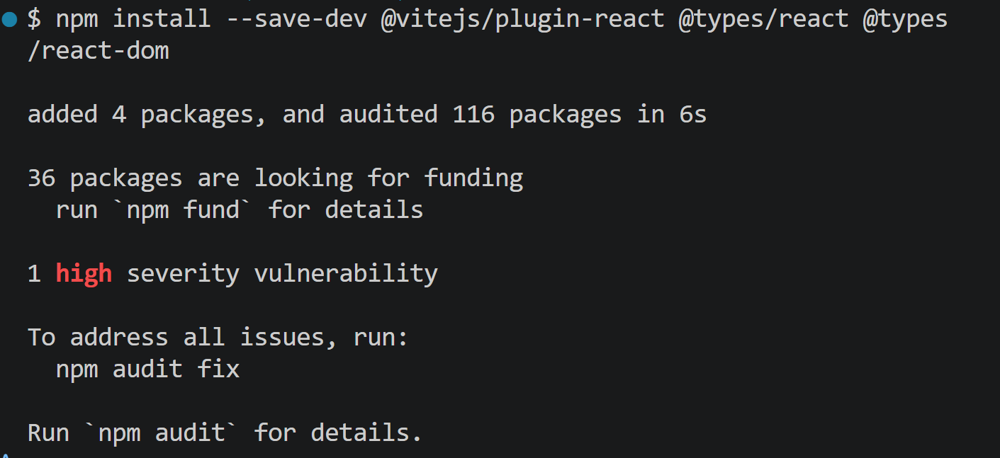

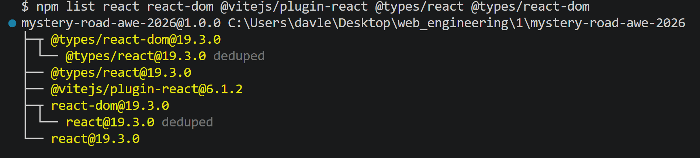

## Welche Konfiguration ist nötig?

Der vorhandene `vite.config.ts` wurde erweitert, nicht ersetzt. `react()` steht jetzt unter `plugins`. Diese bestehende Einstellung blieb erhalten:

```ts
base: "/mystery-road-awe-2026/",
```

Sie sorgt dafür, dass gebaute Dateien auf GitHub Pages unter dem Repository-Pfad gefunden werden. In `tsconfig.json` aktiviert `"jsx": "react-jsx"` die moderne JSX Transformation für `.tsx`.
Vite transformiert den Quellcode für den Browser; `tsc --noEmit` prüft unabhängig davon die Typen.

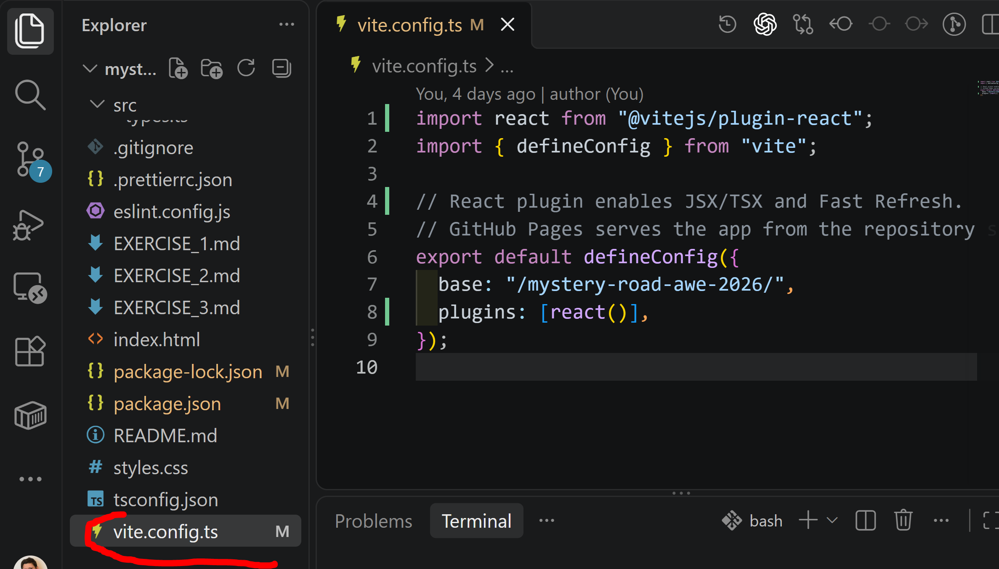

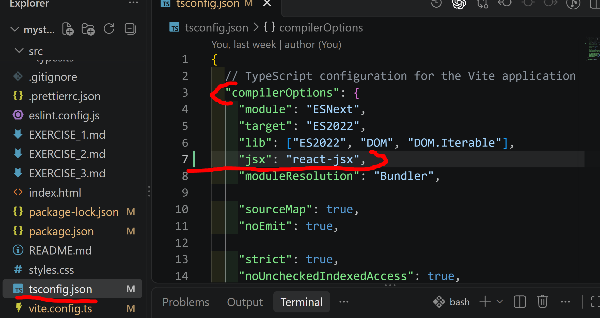

## Wie kommt `<App />` in den DOM?

Der tatsächliche Weg ist:

```text
src/app/App.tsx
→ Import durch src/react/main.tsx
→ Vite transformiert TSX in JavaScript
→ <App /> erzeugt React Elements
→ createRoot(reactContainer).render(<App />)
→ ReactDOM schreibt die nötigen Knoten in #react-root
```

JSX ist weder ein HTML-String noch direkt ein DOM-Knoten. Es wird zu JavaScript transformiert und beschreibt die gewünschte UI. ReactDOM übernimmt den Commit in den echten DOM.

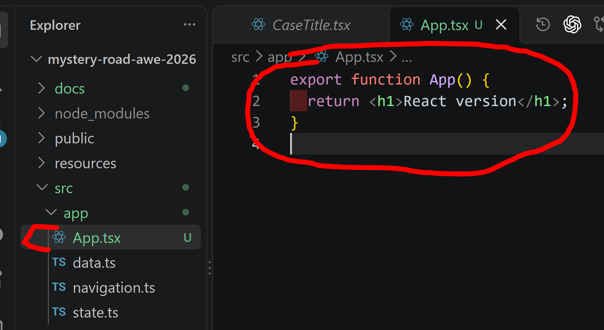

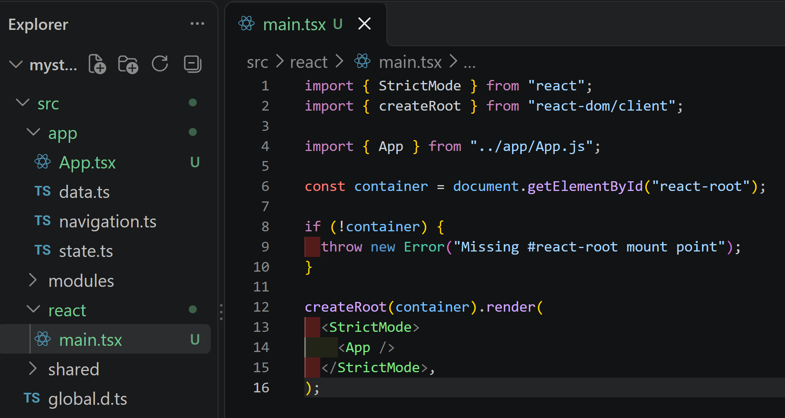

## Gemeinsamer Einstieg und Coexistence

`index.html` lädt nur einen gemeinsamen Bootstrap Entry Point. Dieser liest den Query-Parameter und startet genau eine Version:

```text
/          → Vanilla Entry src/main.ts
/?react=1  → React Entry src/react/main.tsx
```

Lokal gelten diese URLs direkt. Auf GitHub Pages steht davor `/mystery-road-awe-2026/`.
So bleibt die Vanilla-App verfügbar und die unfertige React-Version kann getrennt gezeigt werden.

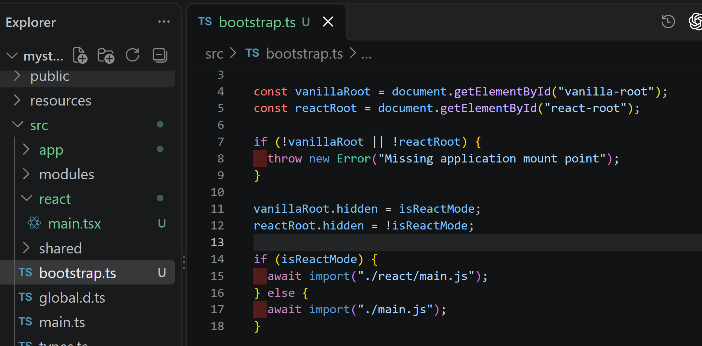

## Warum getrennte DOM-Container?

Vanilla und React haben getrennte Container: `#vanilla-root` und `#react-root`.
Der Bootstrap aktiviert nur die gewählte Version. Dadurch hat jeder DOM-Bereich genau einen Owner.

Weil Vanilla dynamisch importiert wird, prüft `main.ts` zusätzlich `document.readyState`. Nach `DOMContentLoaded` wird `initApp()` sofort aufgerufen.

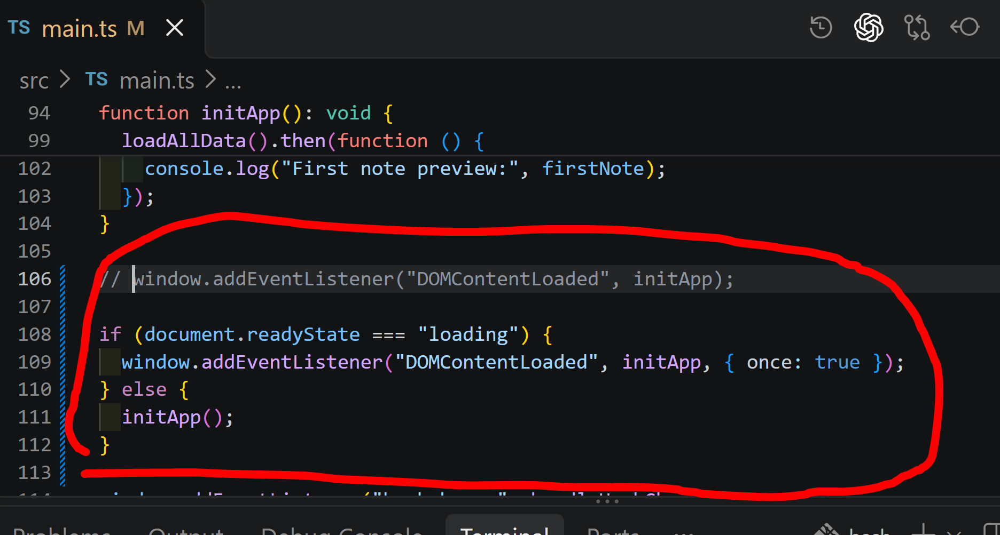

Bei gleichzeitigem Start würden beide Implementierungen UI, Events und globale Handler verwalten.
Das erzeugt doppelte Oberflächen und Fehler. Ein kompletter Austausch ist ebenfalls ungeeignet,
weil die noch nicht migrierten Views dann nicht mehr funktionieren.

## Tooling und Kontrolle

ESLint und die Format-Scripts prüfen nun neben `.ts` auch `.tsx`. Format, Lint, Typecheck und Build
laufen erfolgreich. Beide Varianten wurden im Browser getestet; ihre Consoles blieben fehlerfrei.

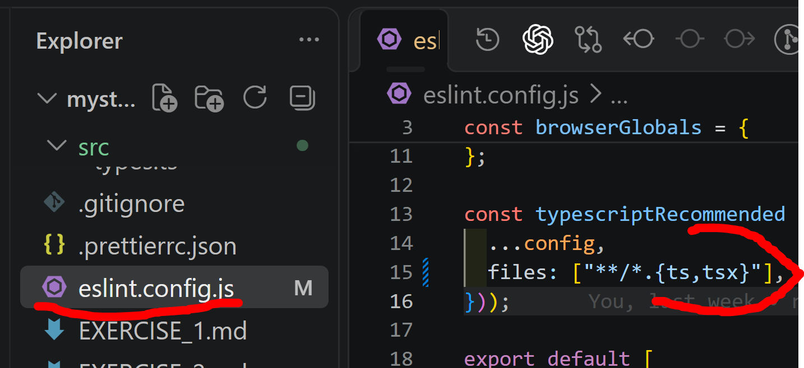

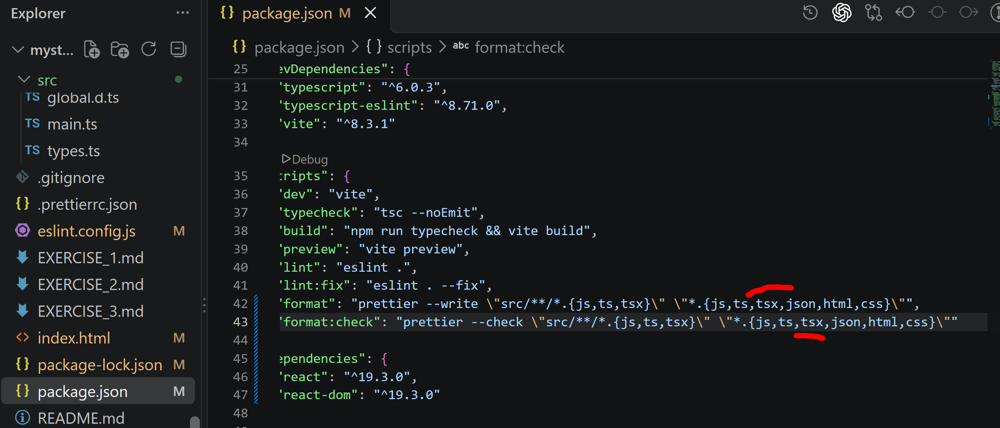

## Kurzfassung für die Präsentation

> React wird als zweite, klar getrennte UI-Version ergänzt. Ein Bootstrap wählt über `?react=1`
> genau einen Entry Point. Vite transformiert TSX, React erzeugt die UI-Beschreibung und ReactDOM
> mountet sie in `#react-root`. Die Vanilla-Version bleibt während der Migration funktionsfähig.

## Durchgeführte Schritte

1. React, ReactDOM, Vite React Plugin und React-Typen installieren:
   ```bash
   npm install react react-dom
   npm install --save-dev @vitejs/plugin-react @types/react @types/react-dom
   ```
2. In `vite.config.ts` `react()` ergänzen und `base` behalten.
3. In `tsconfig.json` `"jsx": "react-jsx"` ergänzen.
4. `src/app/App.tsx` und `src/react/main.tsx` erstellen.
5. Gemeinsamen Bootstrap und zwei getrennte DOM-Container einrichten.
6. `/` auf Vanilla und `/?react=1` auf React schalten.
7. ESLint, Prettier und npm Scripts um `.tsx` erweitern.
8. Alle automatischen Prüfungen ausführen:
   ```bash
   npm run format:check
   npm run lint
   npm run typecheck
   npm run build
   ```
9. Dev Server starten, `/` und `/?react=1` sowie die Browser-Console manuell prüfen:
   ```bash
   npm run dev
   ```

Der abschließende Audit meldet `0 vulnerabilities`; anschließend läuft auch der Produktions-Build erfolgreich durch.

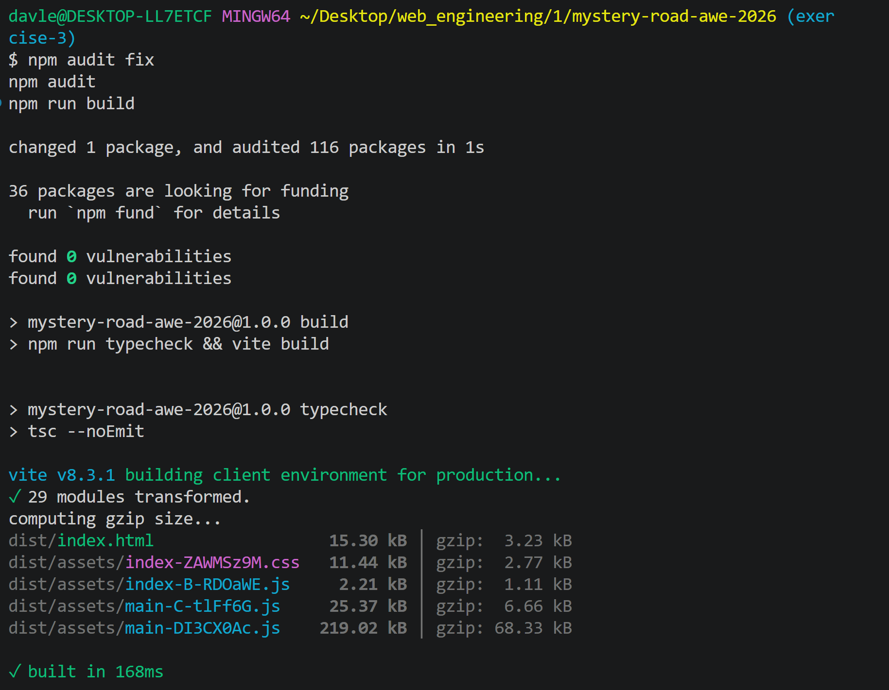
