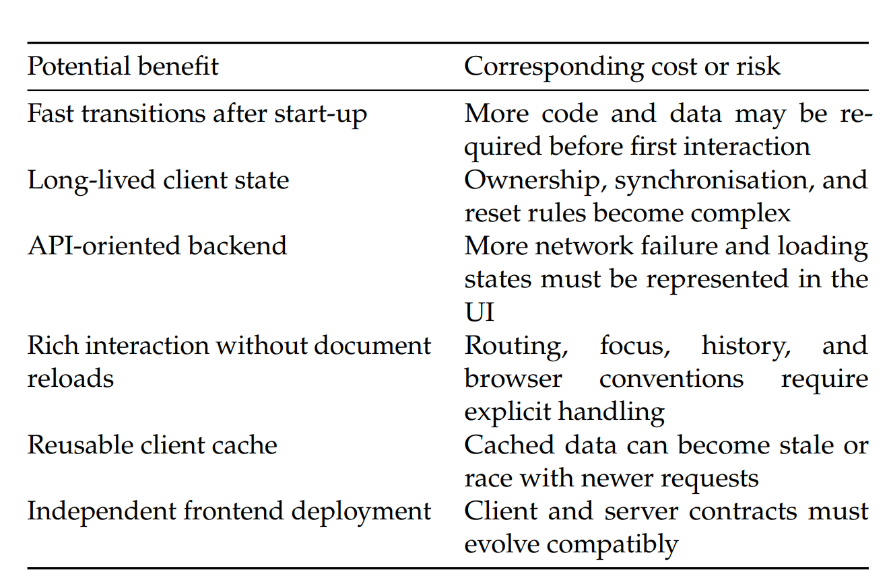
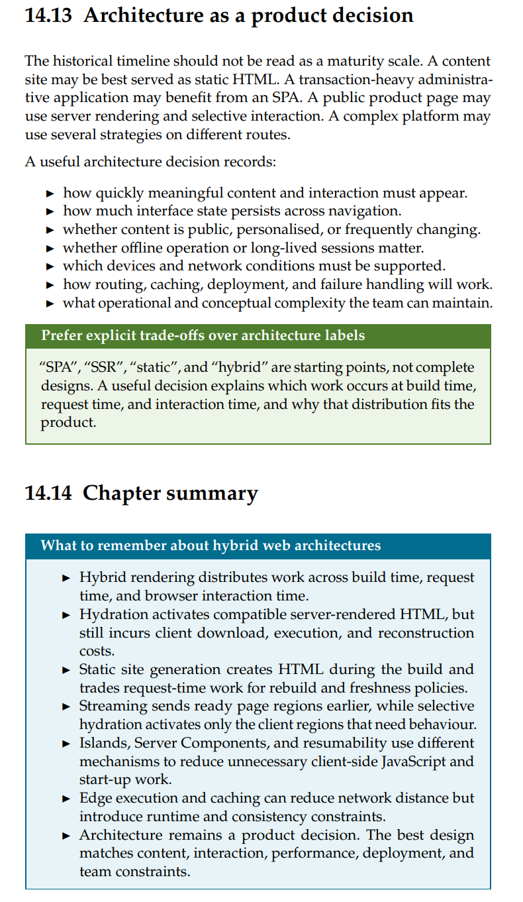

# Demo 8 – ADR: React SPA für Project ReMotion

## Status und Entscheidung

**Status:** akzeptiert für die schrittweise Migration.  
Project ReMotion bleibt eine SPA und die Oberfläche wird schrittweise auf React umgestellt. React ist
hier ein Rendering- und Komponentenmodell, aber nicht die komplette Architektur.

## Kontext

Die Anwendung besitzt fünf eng verbundene Views. Sie lädt gemeinsame Falldaten und verwaltet Filter,
Bookmarks, Notes, Statuswerte und einen Hypothesenentwurf. Benutzer wechseln oft zwischen Evidence,
People, Timeline und Workspace, ohne ihren Arbeitskontext verlieren zu wollen.

Sie ist ein interaktives Arbeitswerkzeug und keine öffentliche Content-Seite. SEO und Lesen ohne
JavaScript sind deshalb weniger wichtig als schnelle Wechsel und konsistenter gemeinsamer State.

## Warum SPA und React passen

- Navigation ohne Document Reload passt zum Untersuchungs-Workflow.
- Bereits geladene Falldaten können von mehreren Views genutzt werden.
- Cards, Badges, Navigation und Listen lassen sich als Komponenten wiederverwenden.
- Deklaratives Rendering reduziert manuelle `innerHTML`-Updates und Synchronisationsfehler.
- React hat ein großes Ökosystem und bietet eine klare Basis für die nächsten Migrationen.
- Die bestehende Vite- und TypeScript-Umgebung passt bereits gut dazu.

## Ehrliche Nachteile

- React vergrößert JavaScript-Bundle, Dependencies und Start-up-Arbeit.
- JSX braucht einen Build-Schritt; das Team muss React, Hooks und Reconciliation verstehen.
- Für die heutige kleine Datenmenge funktioniert Vanilla TypeScript bereits und wäre leichter.
- Während der Migration existieren zwei Rendering-Modelle und damit zusätzliche Komplexität.
- Eine SPA muss Loading-, Error-, Routing-, History- und stale-data-Zustände selbst behandeln.
- React löst Routing, Datenzugriff, Persistenz, Authentifizierung und Deployment nicht automatisch.
- Falsch platzierter State oder unnötige Re-Renders können neue Performance-Probleme erzeugen.

## Alternative 1: servergerendertes Vanilla HTML/JS

Damit könnten Nutzer früher vollständiges HTML sehen, die Seite wäre ohne JavaScript besser nutzbar
und der Client wäre kleiner. Für dieses Projekt würden wir aber Folgendes verlieren:

- direkte View-Wechsel ohne neues Dokument;
- temporären UI-State zwischen den Views;
- einfache gemeinsame Nutzung bereits geladener Falldaten;
- das aktuelle reine Static-Hosting ohne eigenen Runtime-Server;
- einen Teil der Desktop-App-ähnlichen Bedienung.

Filter, Modals und Workspace bräuchten trotzdem JavaScript oder mehr Server-Requests. SSR wäre daher
nicht automatisch einfacher.

## Alternative 2: Vanilla SPA oder leichtere Library

Eine Vanilla SPA mit Router oder eine kleinere Library hätte weniger Runtime-Code, weniger
Konventionen und wahrscheinlich einen schnelleren Start. Durch React verlieren wir diese Einfachheit
und akzeptieren mehr Framework-Abhängigkeit.

Dafür erhalten wir ein einheitliches Komponentenmodell, deklarative Updates, gute TypeScript-
Integration und ein großes Ökosystem. Wegen der geplanten Migration aller Views wiegt dieser Nutzen
mehr als bei einer kleinen, fast statischen Website.

## Nutzer mit schwachen Geräten oder schlechter Verbindung

Wäre das eine harte Anforderung, würde ich keine reine CSR-SPA als Standard wählen. Ich würde den
ersten Dashboard-Inhalt serverseitig oder beim Build als HTML erzeugen und Interaktivität progressiv
laden. Weitere Views könnten lazy geladen und JavaScript stärker aufgeteilt werden.

React könnte für interaktive Inseln oder mit einem SSR/SSG-Framework bleiben. Die Entscheidung gegen
eine reine SPA bedeutet also nicht automatisch eine Entscheidung gegen React.

## Konsequenzen

Die gewählte React SPA passt zum aktuellen interaktiven Produkt und zur weiteren Kursmigration. Wir
akzeptieren dafür mehr Client-Code, Build- und Lernaufwand. Routing, Datenhaltung, Persistenz und
Deployment bleiben eigene Entscheidungen und müssen weiterhin bewusst entworfen werden.

## Kurzer Abschluss für die Präsentation

React ist hier sinnvoll, weil viele Views gemeinsamen State und wiederverwendbare UI brauchen. Es ist
aber keine allgemeine Verbesserung für jede Website. Bei hartem Low-End- und Netzwerk-Ziel würde ich
eine hybride, progressiv verbesserte Architektur statt einer reinen CSR-SPA wählen.
