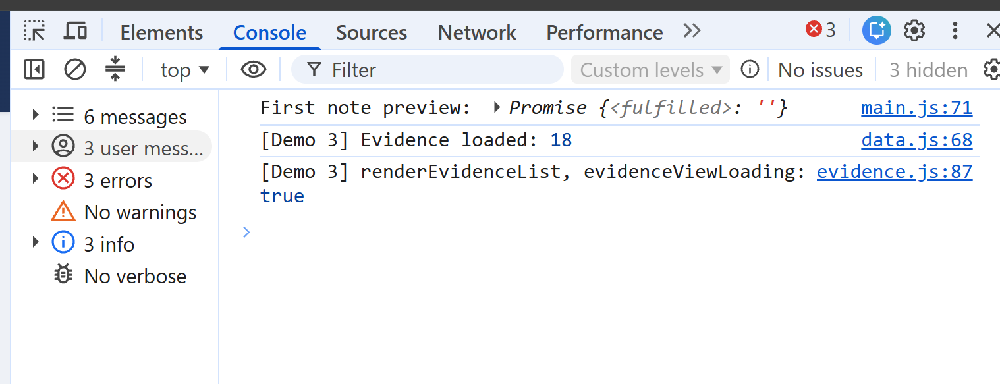
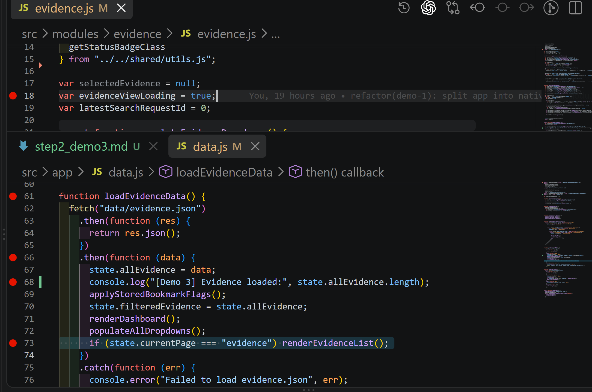
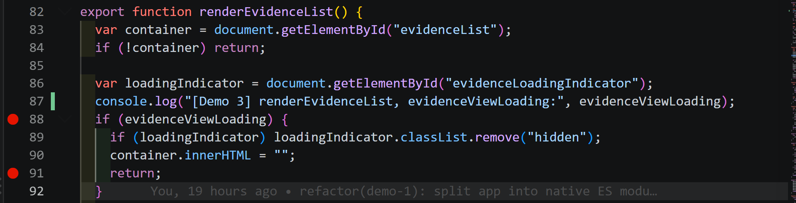
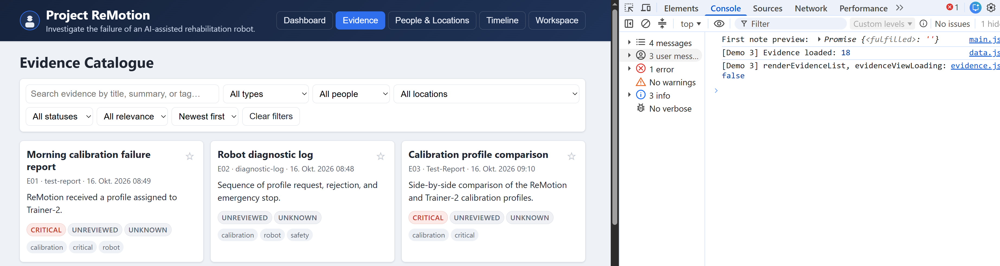

# Demo 3 – Asynchroner/Promise-Fehler

## Ziel

Den dauerhaft sichtbaren Ladezustand im Evidence-Katalog untersuchen und mit einer minimalen Änderung beheben.

## Mini-Plan

1. Fehler reproduzieren: Evidence-Ansicht bleibt bei „Loading evidence...“ stehen.
2. Diagnose protokollieren: `evidence.json` wird geladen, aber `evidenceViewLoading` bleibt `true`.
3. Ursache bestätigen: `renderEvidenceList()` beendet sich deshalb vor dem Rendern.
4. Ladeende über eine exportierte Funktion des Evidence-Moduls setzen.
5. Nach erfolgreichem `fetch()` diese Funktion in `data.js` aufrufen.
6. Ergebnis testen: 18 Einträge werden angezeigt und der Ladeindikator verschwindet.

## Dokumentation

- Screenshot vor dem Fix: Ladeindikator und Diagnose-Logs.
- Screenshot der betroffenen Code-Stellen.
- Screenshot nach dem Fix: Evidence-Liste und `evidenceViewLoading: false`.
- Der Fix wird zunächst mit aktiven Diagnose-Logs committed. In einem nachfolgenden Cleanup-Commit werden diese Logs auskommentiert.





Der Ladezustand wird mit `true` initialisiert.
Das Promise wird erfüllt und 18 Datensätze werden in `state.allEvidence` übernommen.
Danach wird `renderEvidenceList()` erneut aufgerufen.



Obwohl die Evidence-Daten bereits geladen wurden, bleibt `evidenceViewLoading` auf `true`. Dadurch wird die Funktion mit `return` beendet und die Evidence-Liste nicht gerendert.

Der Fehler tritt im Success-Callback auf: `fetch()` und `res.json()` sind bereits erfolgreich abgeschlossen und die Daten wurden gespeichert, aber der Ladezustand wurde vor `renderEvidenceList()` nicht aktualisiert.

## Umsetzung

### Änderung in `evidence.js`

```js
export function finishEvidenceLoading() {
  evidenceViewLoading = false;
}
```

### Änderung in `data.js`

```js
    .then(function (data) {
      state.allEvidence = data;
      console.log("[Demo 3] Evidence loaded:", state.allEvidence.length);
      applyStoredBookmarkFlags();
      state.filteredEvidence = state.allEvidence;
      finishEvidenceLoading();
      renderDashboard();
      populateAllDropdowns();
      if (state.currentPage === "evidence") renderEvidenceList();
    })
```

## Ergebnis

Nach Abschluss des Ladevorgangs wird `evidenceViewLoading` auf `false` gesetzt. Der Ladeindikator verschwindet und alle 18 Evidence-Einträge werden gerendert.



