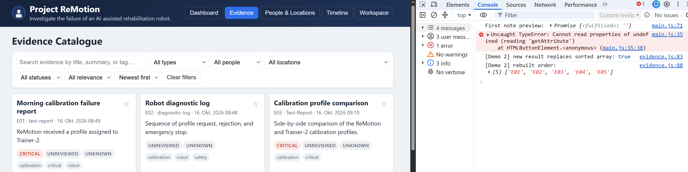
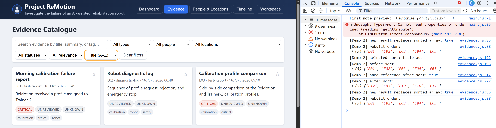
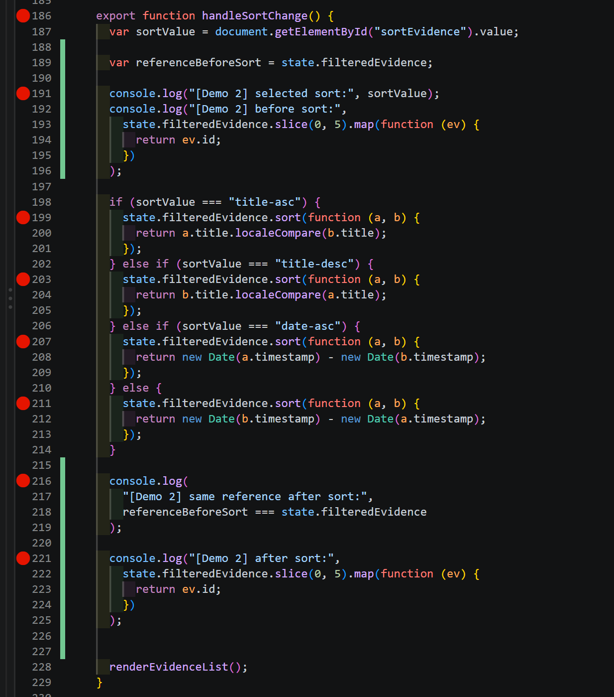
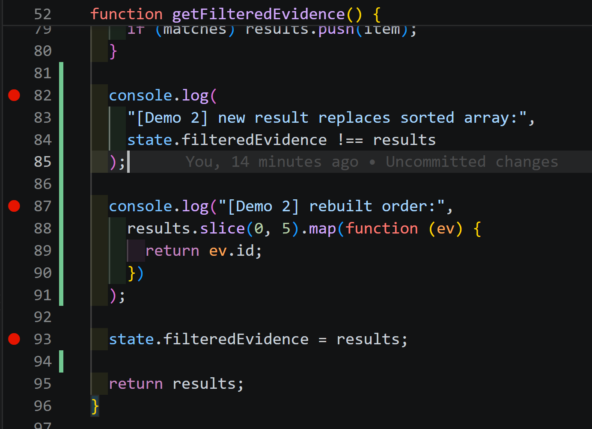
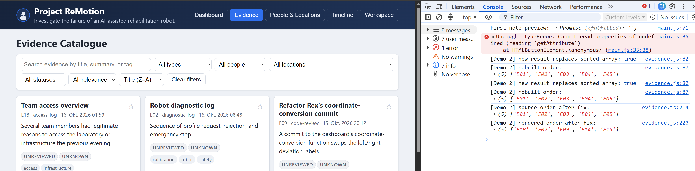

# Demo 2 – Mutation-/Referenzfehler

## Ziel

Den Sortierfehler im Evidence-Katalog reproduzieren, die beteiligten Array-Referenzen untersuchen und anschließend minimal beheben.

## Reproduktion

1. Evidence öffnen und „Newest first“ auswählen.
2. Die ersten Einträge beginnen mit E01, E02 und E03.
3. Danach „Title A–Z“ auswählen.

**Erwartet:** E12 „Approved release manifest“ steht an erster Stelle.
**Tatsächlich:** Die Reihenfolge bleibt unverändert.

## Bestätigte Beobachtung

- Vor der Sortierung: `E01`, `E02`, `E03`, `E04`, `E05`.
- Direkt nach `sort()` zeigt das Log: `E12`, `E03`, `E10`, `E16`, `E17`.
- `sort()` behält dieselbe Array-Referenz und verändert das Array direkt.
- Beim anschließenden Rendern erzeugt `getFilteredEvidence()` ein neues Array in der ursprünglichen Reihenfolge und ersetzt die sortierte Referenz.
- Dadurch wird das sortierte Ergebnis verworfen, bevor es angezeigt wird.

## Durchgeführter Fix

1. `state.filteredEvidence` wird mit `state.allEvidence.slice()` als unabhängiger Array-Container initialisiert.
2. `getFilteredEvidence()` gibt nur noch das gefilterte Ergebnis zurück.
3. `sortEvidence()` erstellt eine Kopie und sortiert diese.
4. `renderEvidenceList()` filtert, sortiert und speichert anschließend das gerenderte Ergebnis.
5. `handleSortChange()` löst nur noch ein erneutes Rendern aus.

## Leitfragen

- **Was ist der Unterschied zwischen einer Array-Referenz und einer Array-Kopie?** Eine Referenz zeigt auf dasselbe Array. `slice()` erstellt eine flache Kopie mit eigener Array-Referenz.
- **Warum verändert `sort()` das vorhandene Array?** Weil `sort()` das Array direkt „in place“ sortiert.
- **Warum ist die sortierte Reihenfolge im Log sichtbar, aber nicht im Katalog?** `getFilteredEvidence()` erzeugte danach ein neues, unsortiertes Array und ersetzte das sortierte Ergebnis.

## Screenshots

- `demo2-sort-before.png`: Ausgangsreihenfolge bei „Newest first“.

- `demo2-sort-after.png`: „Title A–Z“ ist ausgewählt, die Karten bleiben jedoch unverändert.

- `demo2-root-cause-sort.png`: Mutation durch `sort()` im Code vor dem Fix.

- `demo2-root-cause-replacement.png`: Ersetzen der sortierten Referenz durch `getFilteredEvidence()` vor dem Fix.

- `demo2-sort-fixed.png`: Nach dem Fix funktioniert „Title Z–A“. Die Liste beginnt korrekt mit `E18`, `E02` und `E09`.

