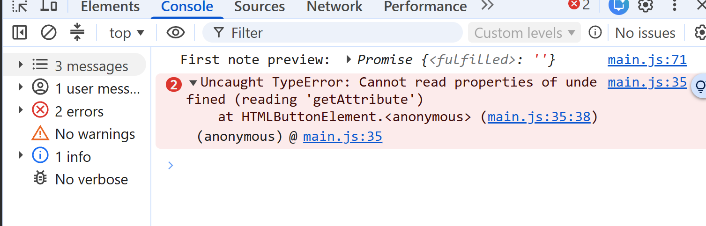
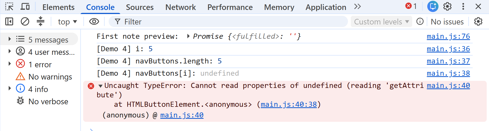
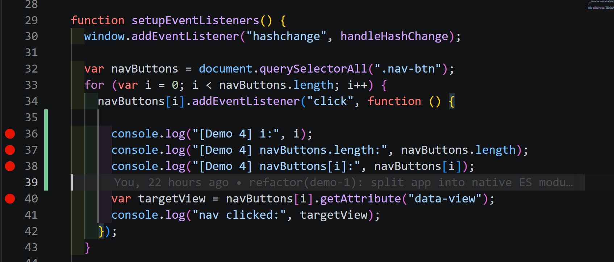
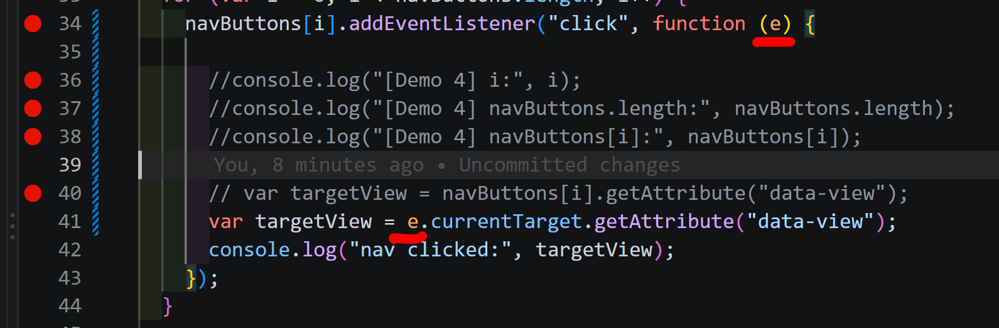
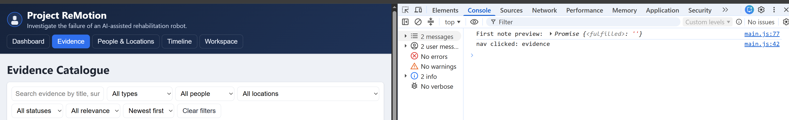

# Demo 4 – Silent (Console-only) Bug

## Ziel

Einen Fehler untersuchen, der beim Benutzen der Hauptnavigation keine sichtbare Störung verursacht, aber in der Browser-Konsole einen `TypeError` auslöst.

## Reproduktion vor dem Fix

1. DevTools öffnen und die Console leeren.
2. Die Anwendung neu laden.
3. Im Header beispielsweise auf „Evidence“ klicken.

**Erwartet:** Die Evidence-Ansicht wird ohne Exception geöffnet.

**Tatsächlich:** Die Evidence-Ansicht wird sichtbar geöffnet, gleichzeitig erscheint in der Console:

```text
Uncaught TypeError: Cannot read properties of undefined (reading 'getAttribute')
    at HTMLButtonElement.<anonymous> (main.js:35:38)
```

Der erste Screenshot dokumentiert die exakte Fehlermeldung. Die separate Ausgabe `First note preview: Promise ...` gehört nicht zu diesem Fehler.



## Warum funktioniert die Navigation trotzdem?

Jeder Navigationsbutton besitzt bereits einen Inline-Handler wie `onclick="navigateTo('evidence')"`. Dieser Handler führt den sichtbaren Ansichtswechsel aus.

In `setupEventListeners()` wird zusätzlich ein Click-Listener registriert. Dieser soll nur das Attribut `data-view` lesen und den Wert protokollieren. Der zusätzliche Listener schlägt fehl, während der eigentliche Ansichtswechsel weiterhin funktioniert.

## Bestätigte Ursache

`setupEventListeners()` findet fünf Navigationsbuttons. Ihre gültigen Indizes reichen deshalb von `0` bis `4`.

Die Schleifenvariable `i` wird mit `var` deklariert und ist funktionsweit gültig. Alle Click-Callbacks greifen später auf dieselbe Variable zu. Wenn ein Benutzer nach Abschluss der Schleife klickt, gelten folgende Werte:

- `i === 5`
- `navButtons.length === 5`
- `navButtons[i] === undefined`

Dadurch wird `getAttribute()` auf `undefined` aufgerufen und der `TypeError` ausgelöst. Die temporären Diagnoseausgaben bestätigen diese Werte. Durch ihre zusätzlichen Zeilen verschiebt sich die Fehlerstelle im Diagnose-Screenshot von Zeile 35 auf Zeile 40.



Der folgende Screenshot zeigt den betroffenen Loop, die gemeinsam verwendete Variable `i`, den später ausgeführten Callback und den fehlerhaften Zugriff auf `navButtons[i]`.



## Durchgeführter Fix

Der Callback erhält das ausgelöste Event als lokalen Parameter `e`. Über `e.currentTarget` wird direkt der Button gelesen, dessen Listener gerade ausgeführt wird:

```js
navButtons[i].addEventListener("click", function (e) {
  var targetView = e.currentTarget.getAttribute("data-view");
  console.log("nav clicked:", targetView);
});
```

Damit hängt der später ausgeführte Callback nicht mehr vom bereits abgeschlossenen Schleifenindex ab. `currentTarget` bezeichnet zuverlässig den Button, an dem dieser Listener registriert wurde. Der lokale Parameter `e` verwendet außerdem nicht die veraltete globale Eigenschaft `window.event`.

Die temporären Diagnoseausgaben und die fehlerhafte ursprüngliche Zeile bleiben für die Demonstration auskommentiert im Quelltext erhalten.



## Ergebnis

Beim dokumentierten Test wird die Evidence-Ansicht weiterhin korrekt geöffnet. Die Console enthält keine Errors oder Warnings mehr und zeigt nur die erwartete Ausgabe `nav clicked: evidence` sowie die separate Promise-Ausgabe.



## Leitfragen

- **Wie wurde der Fehler entdeckt, obwohl in der Oberfläche nichts sichtbar kaputt war?** DevTools war während des Tests geöffnet. Dadurch war die Exception sichtbar, obwohl der Inline-Handler die Ansicht weiterhin wechselte.
- **Warum bedeutet „Die Oberfläche funktioniert“ nicht automatisch, dass der Code fehlerfrei ausgeführt wird?** Ein unabhängiger Teil der Verarbeitung kann fehlschlagen, während ein anderer Handler das sichtbare Ergebnis trotzdem erzeugt. Die Exception bricht den betroffenen Callback ab und würde auch jede spätere Logik darin verhindern.

## Abgrenzung

In diesem Schritt wurde nur der Console-only-Fehler des Navigations-Listeners behoben. Die Promise-Ausgabe bei `First note preview` sowie andere mögliche Auffälligkeiten gehören nicht zu diesem Fix.
