# Demo 5 – Full Walkthrough & Reflection

## Ziel

Alle Views mehrfach testen und neue Fehler mit Ursache, Fix und Verifikation dokumentieren.

## Walkthrough

- Dashboard, Evidence, People, Locations und Timeline wurden mit Navigation, Filtern, Sortierung und Details geprüft.
- Workspace, Storage und DevTools wurden einschließlich Persistenz, Randfällen und Regression der Demos 2–4 geprüft.

## Fehler 1 – Veraltete Dashboard-Statistik

**Reproduktion:** `E14` bookmarken und ohne Reload zum bereits gerenderten Dashboard zurückkehren.
**Erwartet/Tatsächlich:** Erwartet wird der neue Zähler; tatsächlich bleibt der alte Wert sichtbar.
**Ursache:** `state.viewRendered.dashboard` verhindert ein erneutes `renderDashboard()`.
**Fix/Verifikation:** Dashboard immer neu rendern; Bookmark- und Review-Zähler sind danach ohne Reload aktuell.
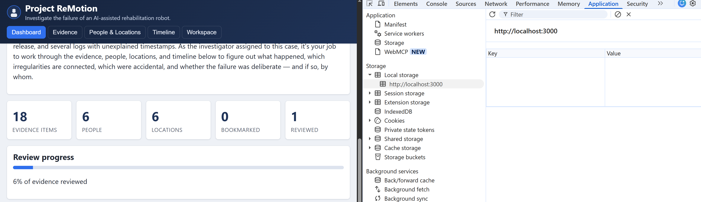 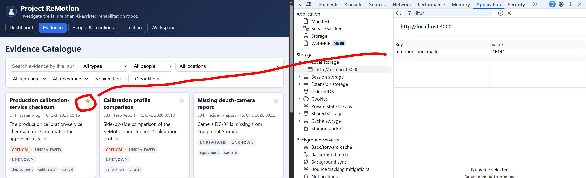 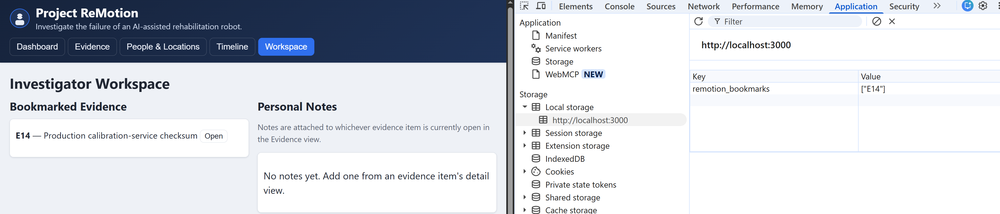
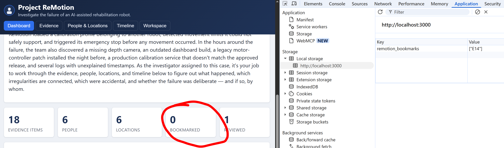 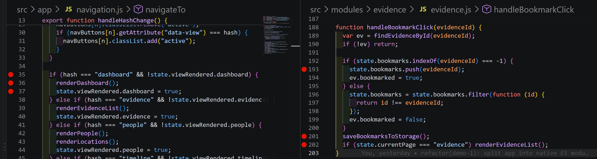 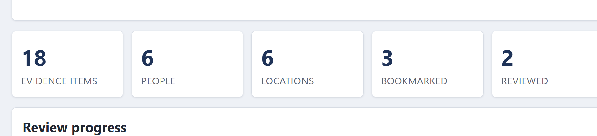

## Fehler 2 – Location als `[object Object]`

**Reproduktion:** Timeline öffnen und ein Ereignis mit Location anzeigen.
**Erwartet/Tatsächlich:** Erwartet wird der Ortsname; tatsächlich erscheint `[object Object]`.
**Ursache:** `findLocationById()` liefert ein Objekt, das `join()` implizit in einen String umwandelt.
**Fix/Verifikation:** `evtLoc.name` einfügen; danach zeigt die Timeline einen lesbaren Ortsnamen.
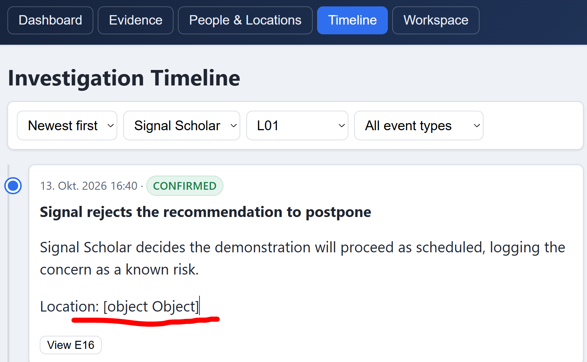 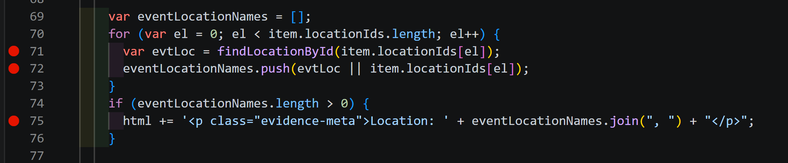
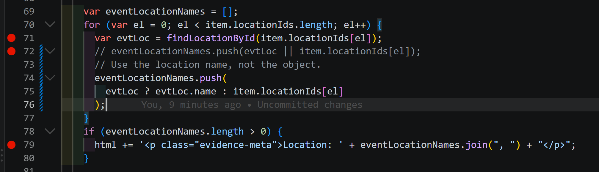 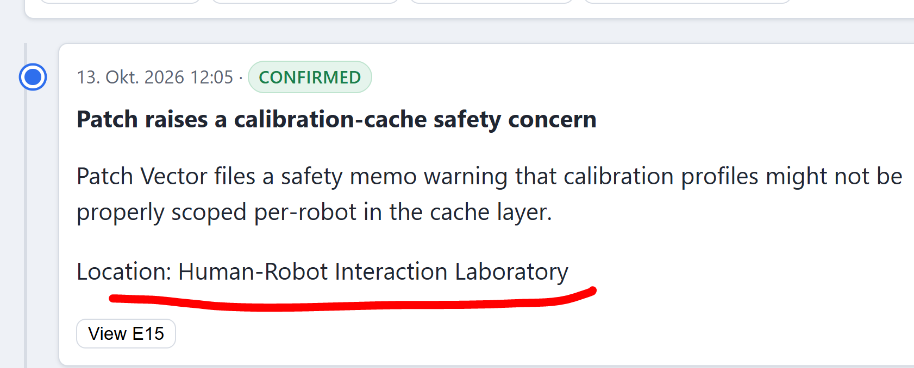

## Fehler 3 – Leerer Workspace nach F5

**Reproduktion:** Mit gültigen Storage-Daten direkt auf `#workspace` neu laden.
**Erwartet/Tatsächlich:** Erwartet werden Bookmarks und Notes; tatsächlich bleiben beide Listen bis zur erneuten Navigation leer.
**Ursache:** `loadAllData()` wartet nicht auf `loadEvidenceData()`; Workspace rendert mit leerem `state.allEvidence` und wird danach nicht aktualisiert.
**Fix:** `loadEvidenceData()` gibt den Fetch-Promise zurück; `loadAllData()` wartet mit `Promise.all()` auf Evidence und Timeline.
**Verifikation:** Nach F5 auf `#workspace` erscheinen Bookmarks und Notes sofort ohne zusätzliche Navigation.
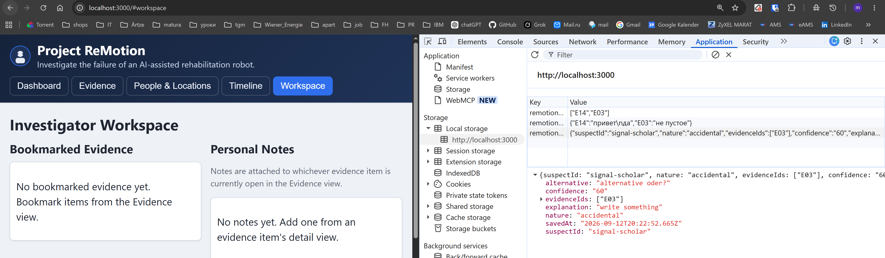 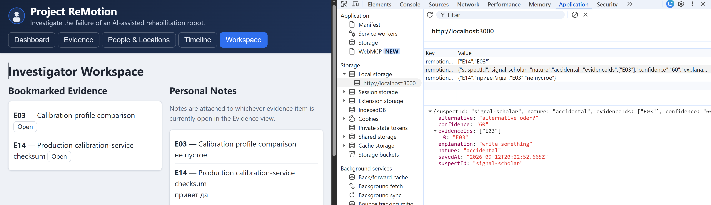 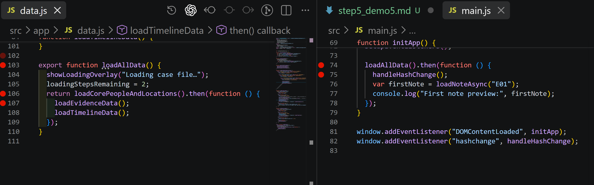
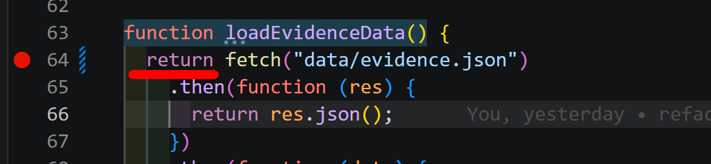 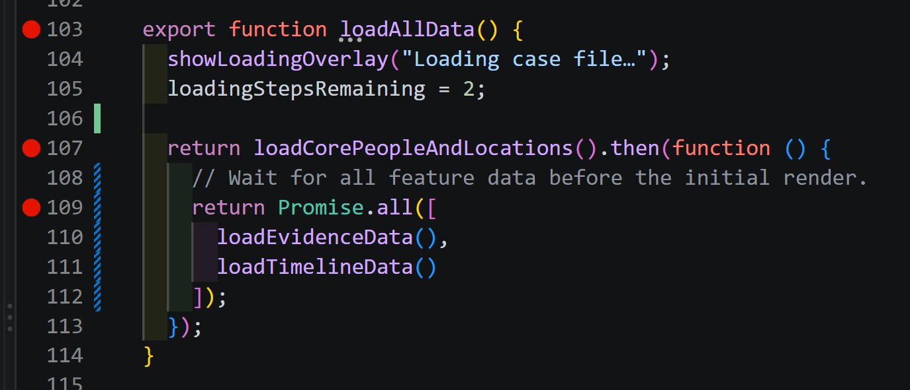 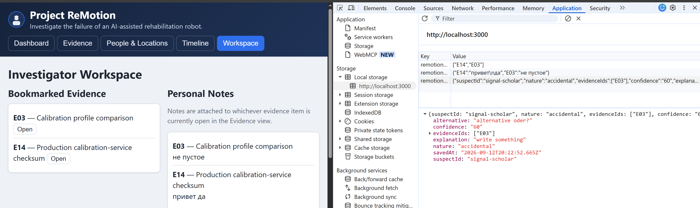

## Fehler 4 – Ungültiges Hypothesis-JSON

**Reproduktion:** `remotion_hypothesis` auf ungültiges JSON setzen und Workspace öffnen.
**Erwartet/Tatsächlich:** Erwartet wird ein sicherer Fallback; tatsächlich beendet ein ungefangener `SyntaxError` das Laden der Hypothese.
**Ursache:** `JSON.parse(raw)` wird ohne Fehlerbehandlung ausgeführt.
**Fix:** Das Parsen erfolgt in `try...catch`; ungültige Daten werden ignoriert und als Warning protokolliert.
**Verifikation:** Workspace bleibt mit ungültigem JSON benutzbar und die Console zeigt keinen Error mehr.
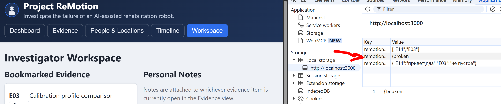 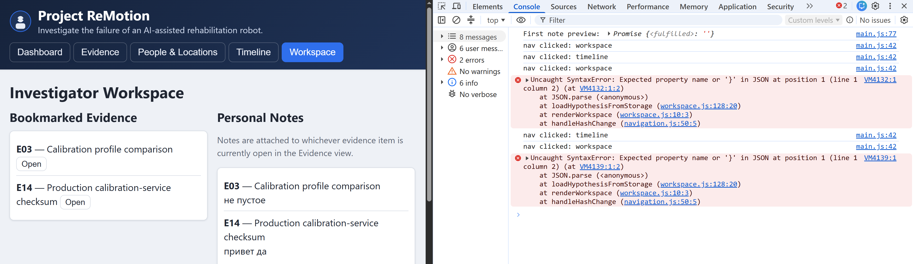 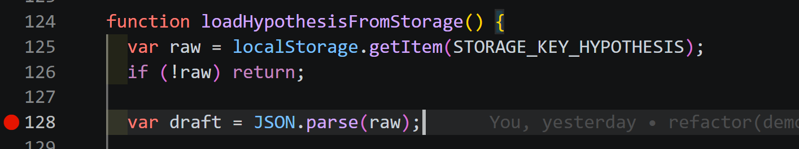
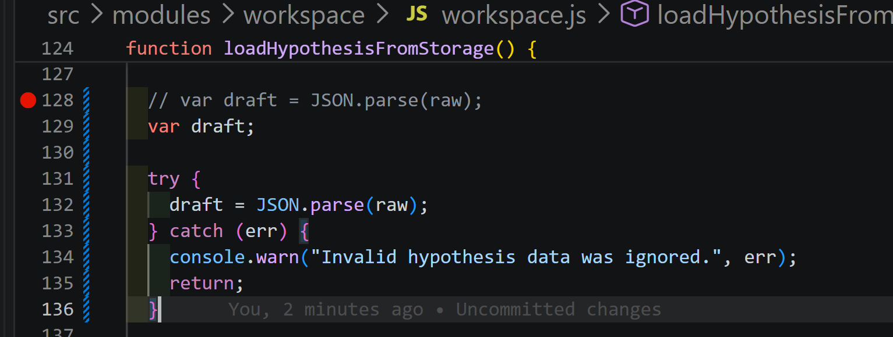 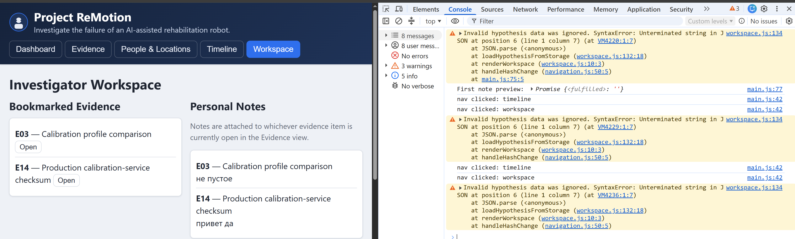 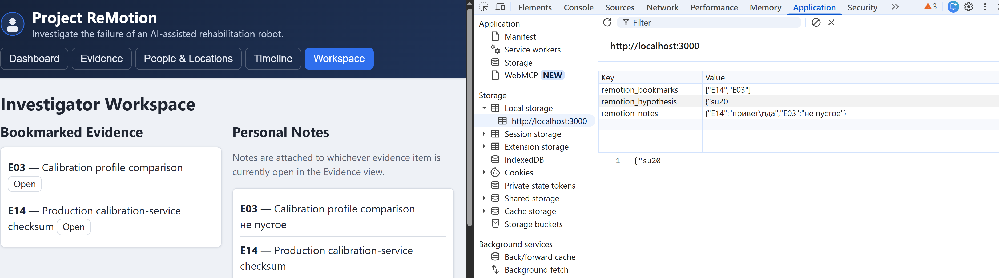

## Reflection

Entscheidend waren wiederholte Navigation und der Vergleich von State, Storage und DOM. Die vier isolierten Fixes sowie die Demos 2–4 wurden erfolgreich regressionsgetestet; es traten keine weiteren Anwendungsfehler auf.
