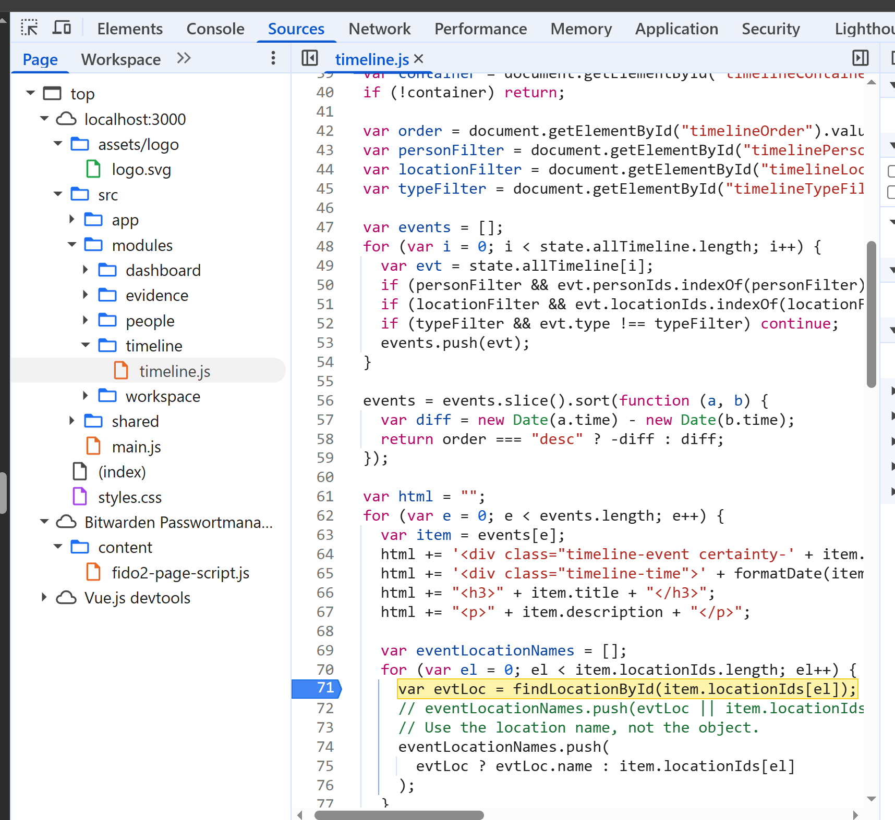
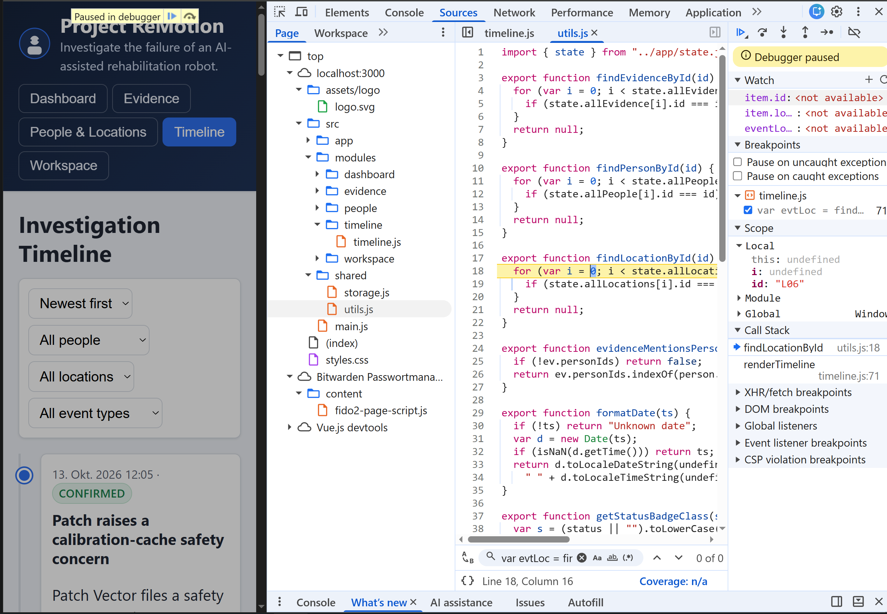
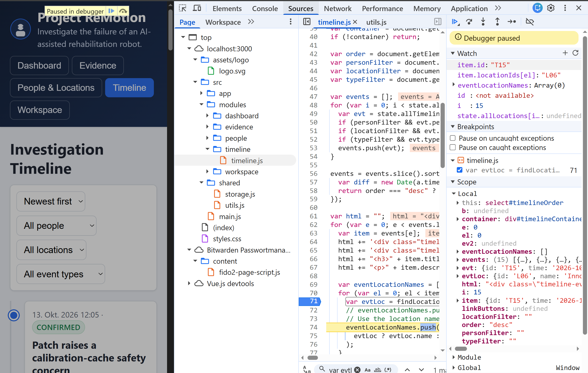
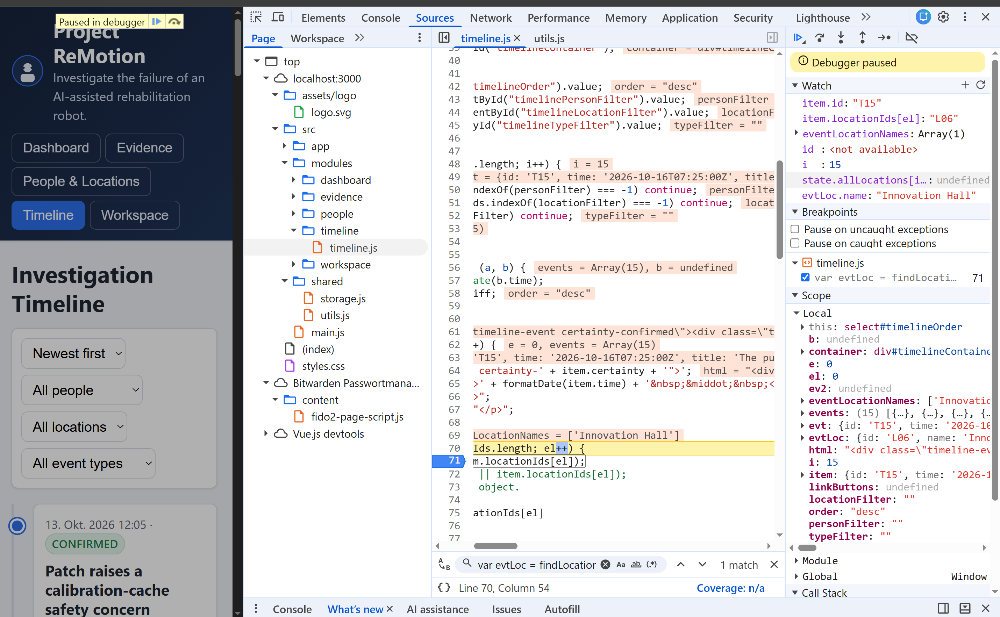
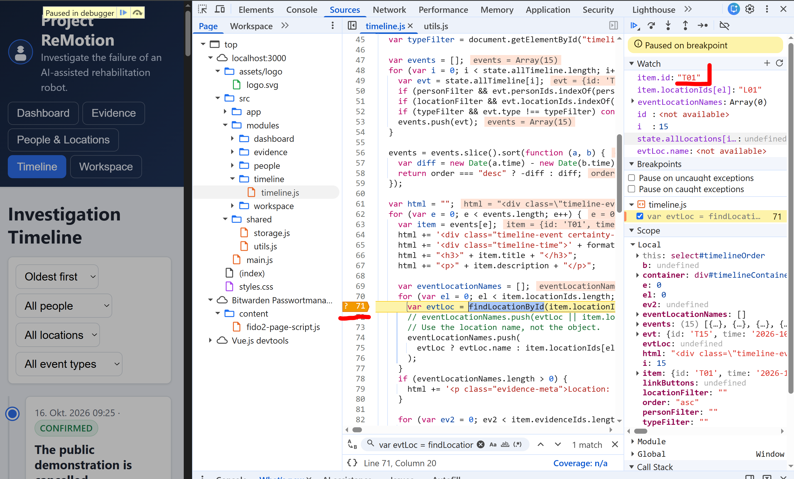
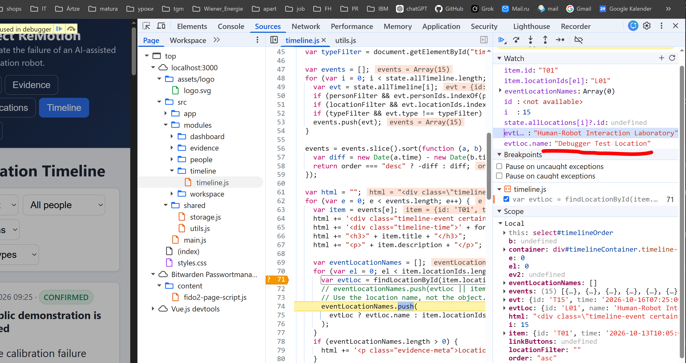
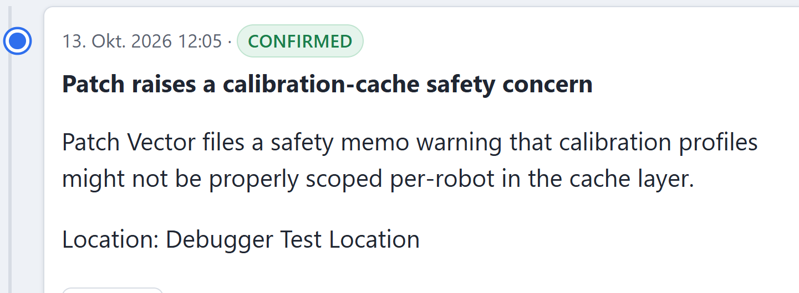

# Demo 6 – JavaScript-Debugger

## Ziel und untersuchte Stelle

Der in Demo 5 behobene Timeline-Fehler wurde ohne zusätzliche `console.log`-Ausgaben mit dem Chrome-Debugger untersucht. In `renderTimeline()` wurde bei Zeile 71 ein echter Breakpoint gesetzt. Dort ruft die Anwendung `findLocationById(item.locationIds[el])` auf.



## Step into, Step out und Step over

- **Step into** öffnete `findLocationById()` in `utils.js`. Im Scope war das Argument `id === "L06"` sichtbar.
- Der **Call Stack** zeigte `renderTimeline()` als Aufrufer und `findLocationById()` als aktuelle Funktion. Damit war nachvollziehbar, woher die Location-ID kam.
- **Step out** kehrte zu `renderTimeline()` zurück. `evtLoc` enthielt nun das gefundene Location-Objekt, während `eventLocationNames` noch leer war.
- **Step over** führte `eventLocationNames.push(...)` aus, ohne in den Aufruf hineinzugehen. Danach enthielt das Array den Namen `"Innovation Hall"`.





## Conditional Breakpoint

Der Breakpoint wurde anschließend auf die Bedingung `item.id === "T01"` gesetzt. Dadurch übersprang der Debugger alle anderen Timeline-Ereignisse und pausierte gezielt bei T01.



## Watch, Scope und Live-Änderung

Über Watch wurden `item.id`, `item.locationIds[el]`, `eventLocationNames` und `evtLoc.name` über mehrere Schritte verfolgt. Während der Pause wurde testweise ausgeführt:

```js
evtLoc.name = "Debugger Test Location";
```

Watch zeigte sofort den neuen Wert. Nach Resume erschien er auch in der Timeline. Die Änderung bestand nur im Arbeitsspeicher; ein Reload stellte die Daten aus der JSON-Datei wieder her. Der Quellcode wurde dabei nicht geändert.




## Leitfragen

- **Step over vs. Step into:** Step over führt die aktuelle Zeile aus und bleibt in derselben Funktion. Step into wechselt in die aufgerufene Funktion. Bei `findLocationById()` war Step into sinnvoll; beim nativen `push()` hätte es nur unnötig von der Anwendungslogik weggeführt.
- **Call Stack:** Er zeigt die aktive Aufrufkette. Hier belegte er: `renderTimeline()` rief `findLocationById("L06")` auf.
- **Conditional Breakpoint:** Er pausiert nur bei erfüllter Bedingung. Mit `item.id === "T01"` mussten nicht alle vorherigen Schleifendurchläufe einzeln fortgesetzt werden.
- **DevTools-Breakpoint vs. `debugger;`:** Ein DevTools-Breakpoint ist lokal und verändert keine Datei. `debugger;` steht im Quellcode und erzeugt bei geöffneten DevTools eine reproduzierbare Pause. Für diese temporäre Untersuchung war der UI-Breakpoint passender.
- **Warum nicht nur Logs?** Eine einzelne Log-Ausgabe hätte weder den Wechsel zwischen Aufrufer und Hilfsfunktion noch die Werte vor und nach jeder Zeile gezeigt. Der Debugger machte Aufrufweg, Scope und die Umwandlung vom Location-Objekt zum Namen direkt im laufenden Zustand sichtbar.

## Ergebnis

Alle geforderten Debugger-Funktionen wurden gezielt verwendet und dokumentiert. Für Demo 6 waren keine Änderungen am Anwendungscode erforderlich.
