# Demo 7 – DevTools Tour

## Console

Die drei Log-Level wurden erzeugt und anschließend getrennt gefiltert. Der Textfilter `Demo 7 warning` zeigte nur die gesuchte Meldung. Mit `Keep log` blieb eine Meldung auch nach dem Reload oberhalb von `Navigated to ...` erhalten.

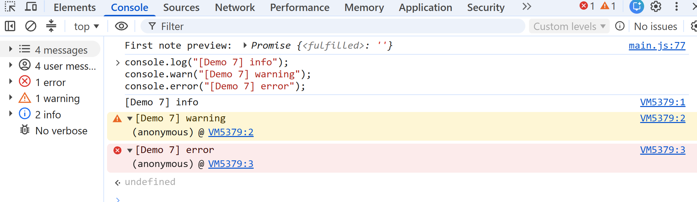
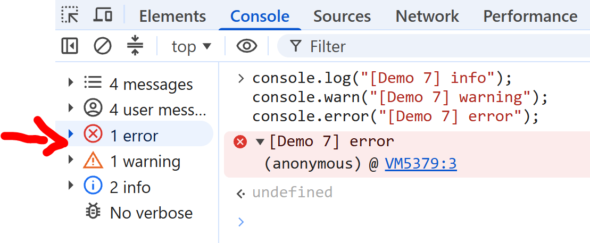
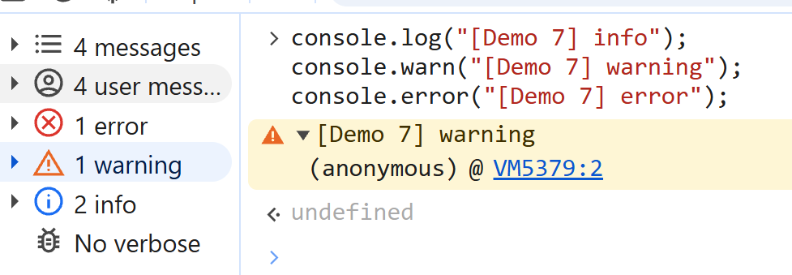
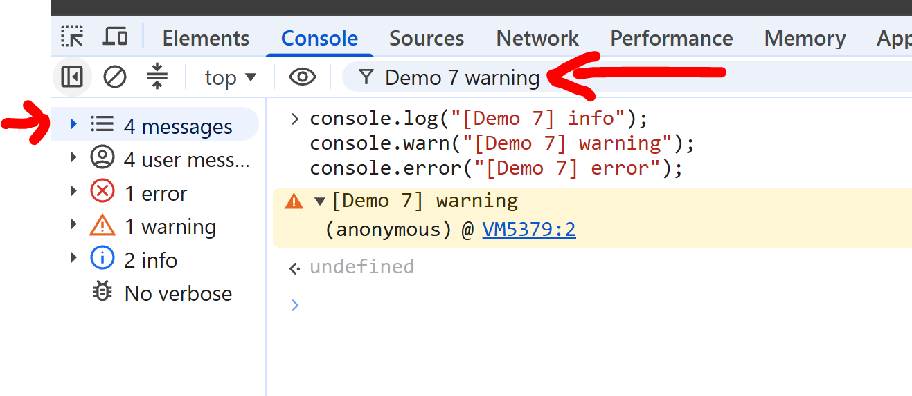
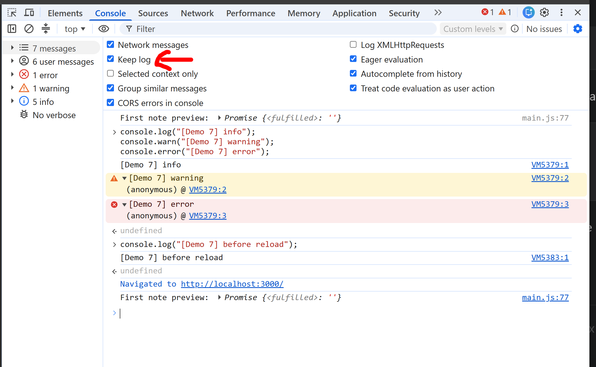

## Network

Der Fetch-Request `data/evidence.json` lieferte `200 OK` und `application/json`. Response und Timing wurden separat geprüft. Unter dem Profil `3G` wurden die längeren Ladezeiten und die Reihenfolge im Netzwerkdiagramm sichtbar.

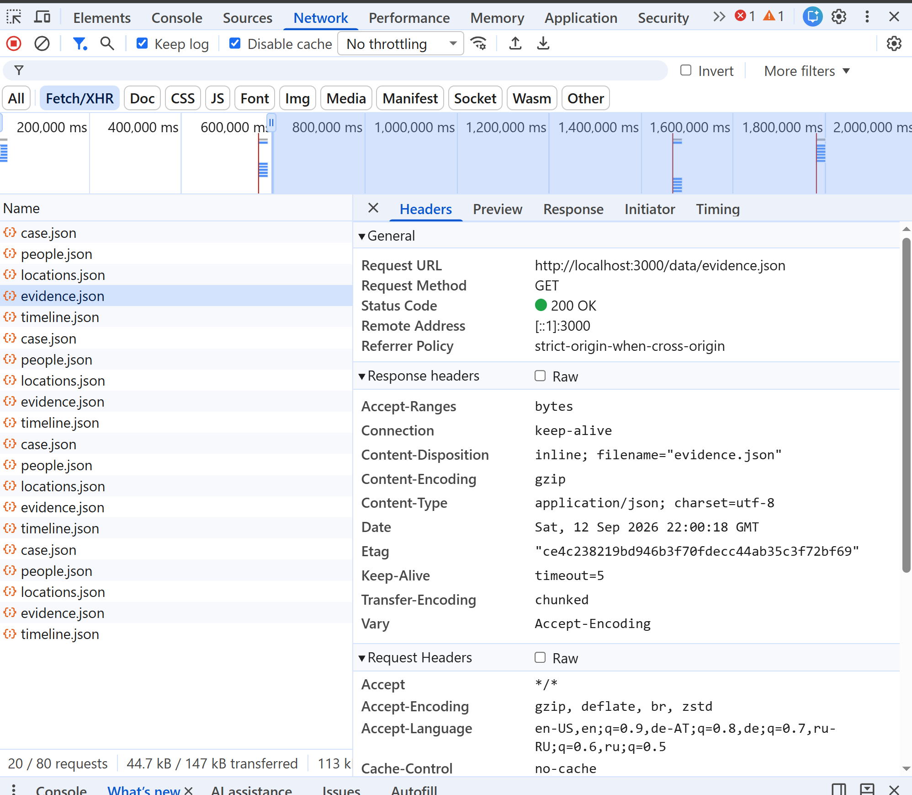
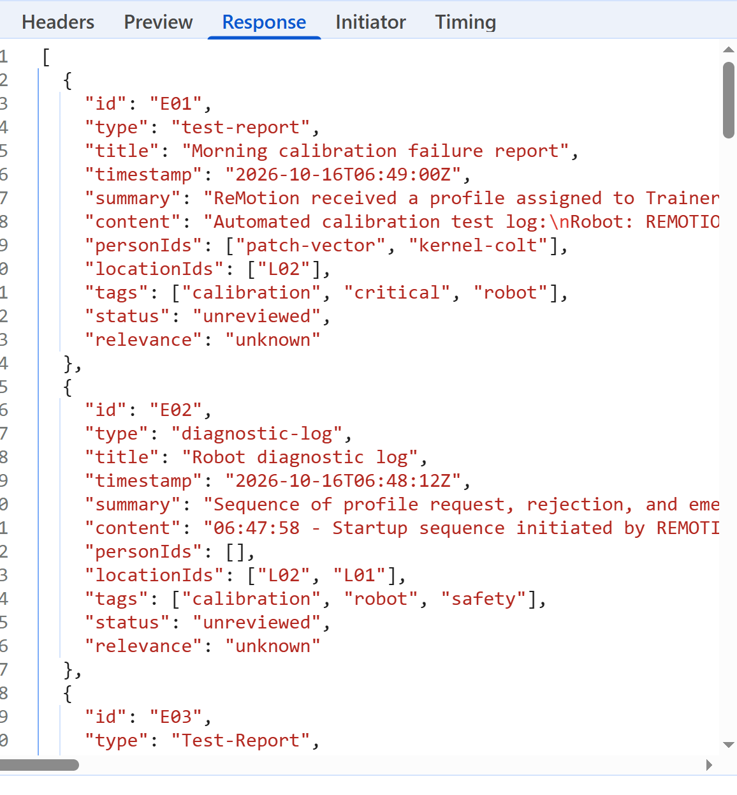
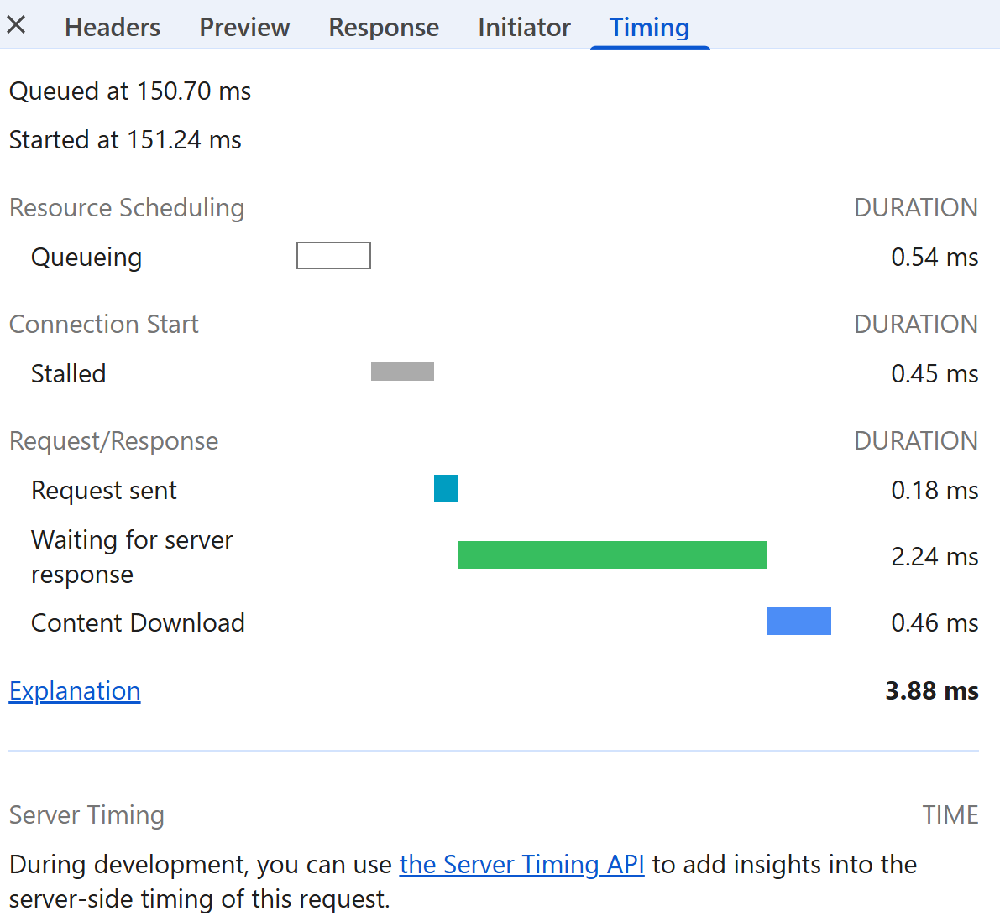
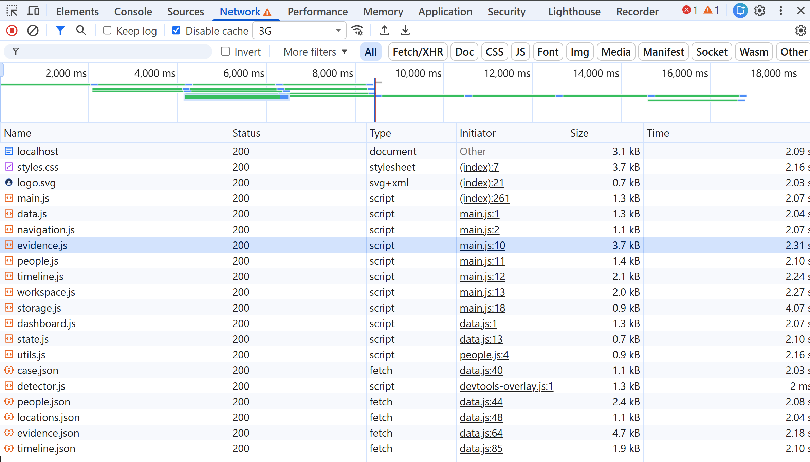

## Application / Local Storage

Die Anwendung verwendet drei Einträge:

- `remotion_bookmarks`: Array der Evidence-IDs
- `remotion_notes`: Notizen nach Evidence-ID
- `remotion_hypothesis`: gespeicherter Hypothesenentwurf

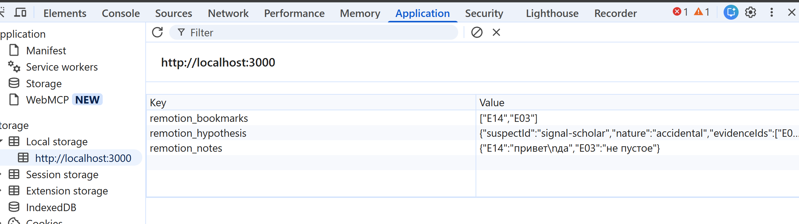

Das direkte Bearbeiten und anschließende Reload wurden bereits im vollständigen Walkthrough von Demo 5 durchgeführt. Dort wurde `remotion_hypothesis` in DevTools auf `{broken` gesetzt. Nach dem Reload fing `try...catch` den Fehler von `JSON.parse()` ab, protokollierte eine Warning und ließ den Workspace weiterhin benutzbar.

## Elements

Die gerenderte Evidence-Karte E14 wurde im DOM untersucht. Elements zeigte `
`, seine Kind-Elemente und die zugehörigen Regeln aus `styles.css`.

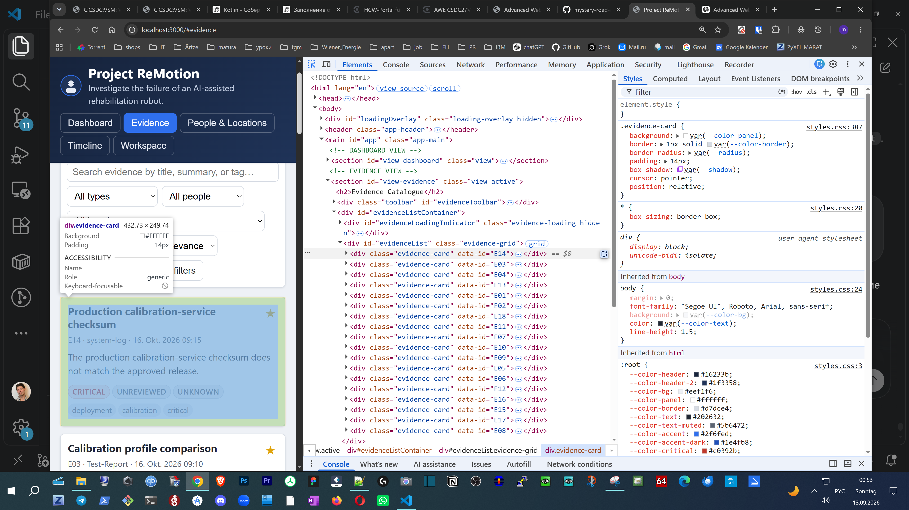

Die DOM-Struktur stammt aus `renderEvidenceCardHTML(ev)` in `evidence.js`: Die Funktion erzeugt Klasse, `data-id`, Titel, Metadaten, Summary, Badges und Tags als HTML-String. `renderEvidenceList()` fügt diesen String anschließend mit `innerHTML` in `#evidenceList` ein.

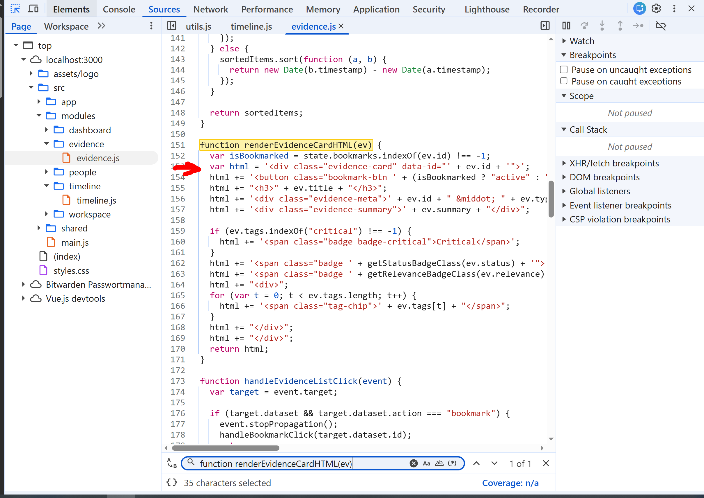

## Leitfragen

- **`log`, `warn`, `error`:** Sie kennzeichnen unterschiedliche Schweregrade und lassen sich getrennt filtern. `warn` markiert ein nicht zwingend abbrechendes Problem, `error` einen Fehler; beide werfen allein noch keine Exception und stoppen JavaScript nicht automatisch.
- **Status, Type und Time:** `200` bestätigt eine erfolgreiche HTTP-Antwort, `fetch` bezeichnet den Request-Typ und `Time` seine Gesamtdauer. Bei `404` lehnt `fetch()` nicht automatisch ab. Da der Code `res.ok` nicht prüft, versucht er trotzdem `res.json()`; bei einer üblichen Nicht-JSON-Fehlerseite landet `evidence.json` anschließend im `catch`, schreibt einen Error und zeigt einen Alert.
- **Local Storage:** `remotion_bookmarks` speichert Evidence-IDs, `remotion_notes` die Notizen und `remotion_hypothesis` den Hypothesenentwurf. Beim getesteten ungültigen Hypothesis-JSON wirft `JSON.parse()` einen `SyntaxError`; der vorhandene `try...catch` ignoriert den Entwurf und protokolliert eine Warning. Bookmarks besitzen ebenfalls einen Fallback, Notes dagegen keine entsprechende Parse-Fehlerbehandlung.
- **3G-Beobachtung:** Zuerst wurden `case.json`, `people.json` und `locations.json` nacheinander geladen; erst danach starteten `evidence.json` und `timeline.json` parallel. Das Loading Overlay blieb während des größten Teils sichtbar. Die Reihenfolge ist wichtig, weil Render-Funktionen und Dropdowns gemeinsamen State lesen und ein zu frühes Rendern sonst vorübergehend leere oder veraltete Daten zeigen kann.

## Ergebnis

Console, Network, Application und Elements wurden praktisch untersucht. Dabei wurde kein Anwendungscode geändert; vorhandene Storage-Screenshots aus Demo 5 wurden für denselben bereits durchgeführten Test wiederverwendet.
